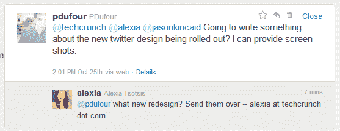

# Twitter 正在测试可扩展的时间线 TechCrunch

> 原文：<https://web.archive.org/web/https://techcrunch.com/2011/10/25/twitter-is-testing-expandable-timeline/>

# Twitter 正在测试一个可扩展的时间线

Twitter 正在测试新的设计变化，这使得 Twitter 的主时间线可以扩展，这样你就可以在时间线中看到媒体和相关信息，而不是在旁边或点击另一个页面。我们收到了几份关于这一变化的报告，只有少数人看到了，(Twitter 证实这是一个“小测试”)。Pinglio [的 Patrick Bisch 在博客](https://web.archive.org/web/20230204225824/http://www.pinglio.com/2011/10/twitter-quietly-rolls-out-new-timeline-updating/)上讲述了这些变化，甚至制作了一个截屏(你可以在下面观看)。

这些变化是微妙的，但它们设法简化了一个已经很简单的服务。你可以“打开”一条推文，看看有多少人转发了这条推文，与这条推文相关的话题，或者相关的照片和视频。例如，这里有一个回复推文和原始推文的截图。(也向告密者保罗·杜福尔致敬)

你会注意到星号、转发和回复按钮也被移到了右上方。你可以关闭推文，返回主时间轴视图。许多 Twitter 客户端长期以来一直包含在线媒体，看到 Twitter 试图找出如何使其成为官方体验的一部分令人鼓舞。每次我不得不点击进入另一个页面来查看图片或弄清楚推文的上下文都是浪费时间(这些点击累积起来，特别是如果你像我一样花这么多时间在 Twitter 上)。

你可以通过观看下面的视频来感受新的体验。

[YouTube = http://YouTube . be/PBT 9 turu 14 u]