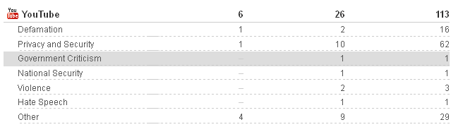

# 谷歌拒绝删除警察暴力视频，仍遵从 63%的政府删除请求 TechCrunch

> 原文：<https://web.archive.org/web/http://techcrunch.com/2011/10/26/google-declines-to-remove-police-brutality-videos-still-complies-with-63-of-govt-takedown-requests/>

# 谷歌拒绝删除警察暴力视频，仍然遵从 63%的政府删除请求

如果你是占领华尔街和其他与警方发生冲突的事件的事实上的发布平台，会发生什么？好吧，你最终会通过半官方渠道收到一封电子邮件，上面写着“请你删除 Pounder 警官涉嫌越权的视频”，而且没有太多选择。尽管谷歌希望避免与当地警方对抗，但如果他们强行逮捕向这些女孩喷洒胡椒的博洛尼亚警官(托尼·博洛尼亚也是如此)，将会产生的反弹对 YouTube 品牌来说是致命的。它保持向上。

另一方面，当一个视频或其他谷歌托管的项目实际上是非法的时，有很多来自政府的合法删除请求，所以他们必须删除，不管他们喜欢与否。这是一条微妙的路线，谷歌希望通过他们的透明度报告来明确他们的立场。与 2011 年上半年相对应的报告有一个有趣的额外小花絮:“我们收到了当地执法机构的要求，要求删除 YouTube 上的警察暴行视频，但我们没有删除。”

为什么这么具体？声明继续说，其他警察视频因诽谤原因被要求删除，也没有被删除。我认为，在这个动荡的时刻，谷歌非常平静地说了一句大声说出来可能不太得体的话:“把你的敏感和有争议的视频数据放在这里。”当然，像 LiveLeak 这样的网站也是一个选择，但 YouTube 发现自己更频繁地成为关注的中心，而且更像是一个流行文化社区，它希望强调自己在这种事情上的合法性。透明度报告是他们鼓励用户信任他们的一种方式，或许也是政府尊重他们的一种方式。

没有具体说明是哪个官员或地区要求删除这段残暴的视频(在谷歌似乎更喜欢的披露水平上，我怀疑它永远不会)，但值得注意的是，它是一个“当地”执法机构。也就是说，谷歌没有收到联邦法官的信，也没有决定对其提出质疑。希望这种小小的热情不会被过高的赌注所压倒，而这种情况确实会发生。与此同时，[正如我写的](https://web.archive.org/web/20230205030719/https://techcrunch.com/2011/06/17/surveillant-society/)，作为我们周围一切的记录者，我们的责任正在增加，知道 YouTube 是我们可以信任的资产是一件好事。

与此相关的是，今年收购的趋势并不明显；尽管[《卫报》](https://web.archive.org/web/20230205030719/http://www.guardian.co.uk/technology/2011/oct/25/google-transparency-report-released)指出撤下请求与前六个月相比增加了 70%(92 对 54)，但他们忽略了在*之前的六个月(T5)(即 2010 年 1 月至 6 月)有高达 128 个撤下请求。然而，谷歌已经开始按原因(诽谤、隐私、仇恨言论等)对撤销请求进行分类，这将是一组有趣的跟踪数据。*

然而，美国政府对用户数据的请求激增:2010 年同期为 5950 对 4287，要求提供 11057 个用户的信息。其中的 93%被“全部或部分”遵守因此，尽管他们在删除数据上表明了立场，但他们在发布数据方面似乎没有任何困难。