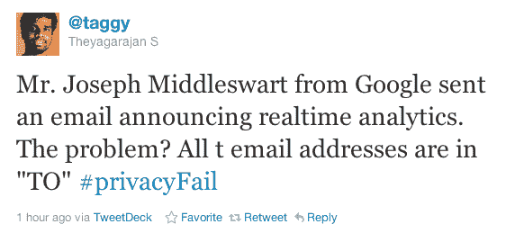
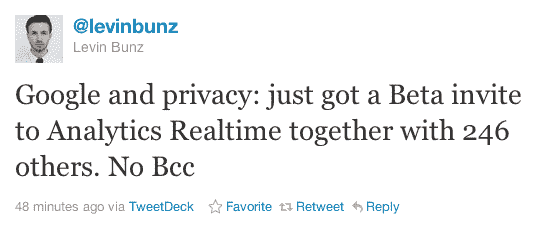

# 谷歌扩大实时分析测试版，在此过程中泄露了数百个电子邮件地址 TechCrunch

> 原文：<https://web.archive.org/web/http://techcrunch.com/2011/10/26/google-opens-real-time-analytics-beta-spills-hundreds-of-e-mail-addresses-in-the-process/>

# 谷歌扩大实时分析测试版，泄露了数百个电子邮件地址

如果你正在排队等待谷歌的实时分析测试版，我们有好消息…也有坏消息。好消息是:谷歌刚刚接纳了新一轮的参与者，所以你加入的几率不会太低。坏消息是:他们在欢迎邮件中混淆了“收件人”和“密件抄送”字段。

出于显而易见的原因，我们不打算公布地址列表——但总的来说，我估计泄露的地址不到 500 个。如果你担心你在某个地方，检查一下你的收件箱，看看有没有一封标题为“欢迎使用实时分析测试版！”，然后检查 To:字段中是否有大约 495 个过多的人。

目前还不清楚这是否是今天进入分析测试版的*所有人的名单，或者这些电子邮件是否是分批发出的，每批大约有 500 名收件人。如果是后者，希望这是唯一一个密件抄送失误的。*

幸运的是，这种错误的影响通常不会太严重*。每个人都会收到几十封电子邮件，人们会开玩笑地回复——都有动物的图片，还有一些唱着“隐私失败！”会消失，但每个人通常都会很快离开。如果你已经申请了测试版，并且你有一个 100%保密的电子邮件地址，你可能会考虑把它换掉。*

你知道，我们已经有一段时间没有看到一个好的时尚 BCC 失败了。实际上，我记得的最后一个是[我们的坏](https://web.archive.org/web/20230203143336/https://techcrunch.com/2011/05/02/techcrunch-disrupt-hackathon-bcc-fail-we-apologize-tcleakers/)。正如 Mike 当时所说的，“我们再也不能取笑任何这样做的人，而不指向[这篇文章。](https://web.archive.org/web/20230203143336/https://techcrunch.com/2011/05/02/techcrunch-disrupt-hackathon-bcc-fail-we-apologize-tcleakers/)

我们联系了谷歌，试图确定有多少电子邮件地址找到了出路。如果有回音，我们会更新这篇文章。

**更新# 1—**谷歌已经迅速道歉。很适合他们:

> 嗨，
> 
> 我们最近发送了一封电子邮件，欢迎您使用实时分析。无意中，我们将电子邮件地址放在了“收件人:”字段中，而不是“密件抄送”字段中。我们真诚地为这个错误道歉，并保证这种事情不会再发生。谢谢你的理解。
> 
> 代表谷歌实时分析团队。

**更新# 2—**哈！邮件的收件人已经组成了一个脸书小组，他们称之为“[实时牛逼的偶然兄弟](https://web.archive.org/web/20230203143336/http://www.facebook.com/groups/165189446907762/)

**更新# 3—**谷歌对此事的官方评论:

> “在分享我们将向更多用户开放实时测试版的消息时，我们的团队无意中向其他被添加的用户暴露了这些用户的电子邮件地址。我们已经向那些用户道歉了。保护用户隐私对我们来说非常重要，我们正在采取预防措施，以确保这种情况不会再次发生。”

