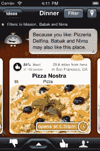
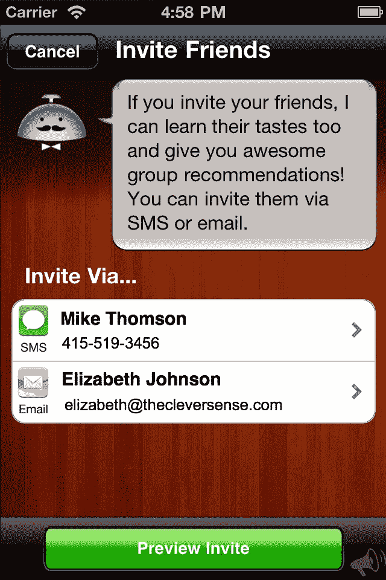

# 本地推荐应用 Alfred 现在提供群体推荐 TechCrunch

> 原文：<https://web.archive.org/web/http://techcrunch.com/2011/10/26/local-recommendations-app-alfred-now-does-group-recommendations/>

Clever Sense 的本地推荐应用程序 [Alfred](https://web.archive.org/web/20230205025615/http://www.alfredmobile.com/) 已经在使用其基于人工智能的系统推荐餐馆、咖啡店、酒吧和夜总会方面做得很好。但是今天，它将做一些更不寻常的事情——它将根据你和谁在一起提出建议。这项新功能今天通过 iTunes 的应用程序更新推出，它将把你个人的喜欢和兴趣与你朋友的喜欢和兴趣结合起来，以便推荐你们都同意的地方。

如果你不熟悉[阿尔弗雷德](https://web.archive.org/web/20230205025615/http://www.alfredmobile.com/)做什么，看看 Jason 早先的评论[这里](https://web.archive.org/web/20230205025615/https://techcrunch.com/2011/07/18/cleversense-launches-alfred-personalized-local-recommendations-with-a-single-tap/)和他对它的技术的深入研究[这里](https://web.archive.org/web/20230205025615/https://techcrunch.com/2011/06/07/cleversenses-seymour-will-take-a-different-approach-to-local-recommendations/)。简单地说，Alfred 是一个智能的、基于算法的推荐系统，它使用一种叫做基于模型的学习来理解你喜欢什么。这个系统可以让 Alfred 构建复杂但高度个性化的推荐。

 为了生成建议， [Alfred](https://web.archive.org/web/20230205025615/http://www.alfredmobile.com/) 对与给定用户相关的数百个属性进行排序。据首席执行官 Babak Pahlavan 称，每个用户平均有 200 个这样的“标签”，帮助 Alfred 了解一个人的个人兴趣。除此之外，阿尔弗雷德本身平均有 24 个明确的“喜欢”。当组合和比较来自一个用户和另一个用户的这些标签时，你现在谈论的是 Alfred 必须考虑的数千个数据点。这里的突破是，Alfred 可以做到这一点，即使对于超过两个的组，对其推荐引擎的性能影响也很小。

换句话说，阿尔弗雷德变得更聪明了，但他并没有因此而慢下来。

但是，只有当您的朋友也是 Alfred 用户时，群组推荐功能才有效。为了鼓励你的朋友尝试这款应用，以便你们俩都能使用这一新功能，该应用现在建议你向他们发送文本或电子邮件邀请。

在未来， [Alfred](https://web.archive.org/web/20230205025615/http://www.alfredmobile.com/) 将开始为其他类别的业务提供建议，但在近期，它正致力于将其技术用于交易建议。Alfred 不会像 [Groupon](https://web.archive.org/web/20230205025615/http://www.groupon.com/) 和 [LivingSocial](https://web.archive.org/web/20230205025615/http://www.livingsocial.com/) 这样的每日交易提供商向我们发送垃圾邮件，而是会利用它对你个人兴趣的了解来推荐你会喜欢的交易。

Pahlavan 说，这种交易监管功能有望在年底实现。该公司还在开发其系统的网络版和安卓版。

更新后的应用程序将在今天的某个时候向 iTunes 用户推出。

