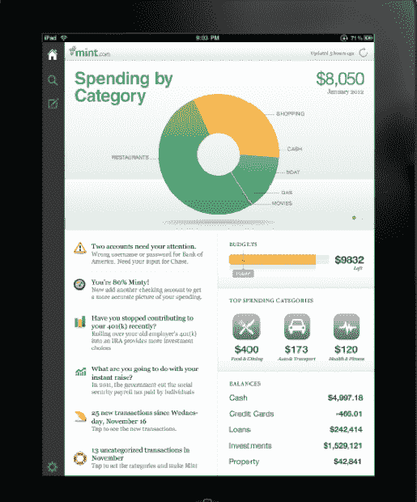
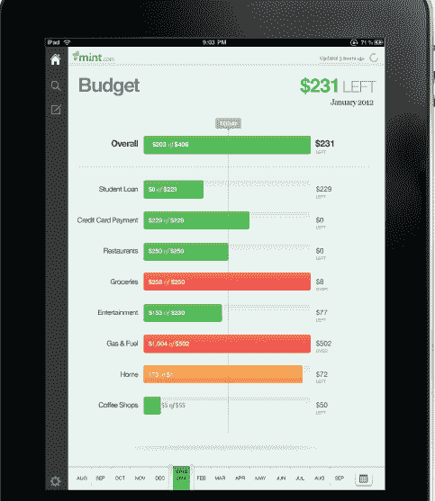

# Mint 终于将个人理财平台引入 iPad TechCrunch

> 原文：<https://web.archive.org/web/http://techcrunch.com/2011/10/26/mint-finally-brings-personal-finance-platform-to-the-ipad/?utm_source=dlvr.it&utm_medium=twitter>

# Mint 终于把个人理财平台带到了 iPad 上

Mint.com 已经可以在各种移动平台上使用，包括 iPhone 和 Android，但还没有开发出 iPad 应用程序。考虑到 iPad 和 factor 平板电脑上其他金融应用程序的受欢迎程度，该设备是 Mint 服务的理想选择。今天， [Intuit 拥有的](https://web.archive.org/web/20230203155329/https://techcrunch.com/2009/09/13/intuit-to-acquire-former-techcrunch50-winner-mint-for-170-million/)Mint.com 终于发布了一款 iPad 应用。你可以在这里下载应用程序[。](https://web.archive.org/web/20230203155329/http://itunes.apple.com/us/app/mint.com-personal-finance/id300238550?mt=8)

iPad 应用程序可以让你在应用程序中的一个地方组织所有账户，并包括账户提醒、账单提醒和个性化建议的流媒体交付。该应用程序利用触摸界面，允许用户捏、点和快速浏览图表，以按类别、商家或预算钻取支出。与 iPhone 应用程序类似，你可以从应用程序中添加交易，它使用 Google places 来识别本地商家以进行输入。

该应用程序使用地理定位功能，帮助人们对现金支出进行分类，并允许您在没有 Wi-Fi 接入的情况下查看您的财务快照。用户还可以同步多个设备，因此在一个平台上对帐户的更改将在所有设备上同步。

Mint 目前拥有 700 万用户，称 iPad 应用是其最快的移动应用之一，因为它支持新发布的 iOS 5 的功能，包括自动引用计数技术。此外，客户将通过应用程序的通知中心接收账单提醒、警报和其他账户活动的即时更新。

作为背景，Mint [在 2007 年赢得了我们的第一次 TechCrunch40 会议，并在两年后被 Intuit 以令人印象深刻的 1 . 7 亿美元收购。那么，为什么一个 iPad 应用程序过了这么久才发布呢？嗯，该公司似乎面临着来自 Intuit 内部的一些成长的烦恼，发布时间已经放缓。当然，该公司也可能一直在等待 iOS 5 的广泛发布。](https://web.archive.org/web/20230203155329/https://techcrunch.com/2007/09/18/mint-wins-techcrunch40-50000-award/)

话虽如此，迟到总比不到好。

