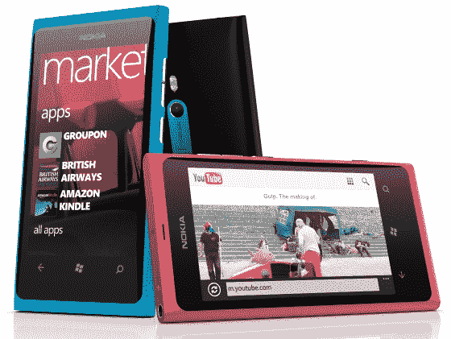
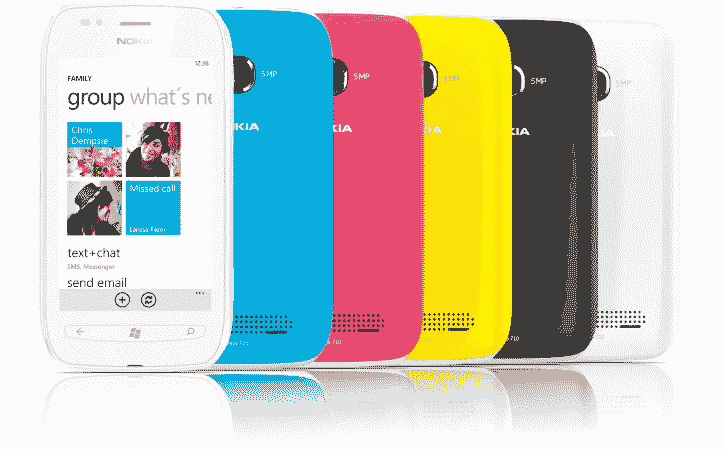

# 诺基亚推出首款 Windows 手机:Lumia 800 和 Lumia 710

> 原文：<https://web.archive.org/web/https://techcrunch.com/2011/10/26/nokia-debuts-lumia-710-and-lumia-800/>

伦敦天气不错，时间还早，诺基亚首席执行官史蒂芬·埃洛普终于在诺基亚世界大会上发布了诺基亚首批 Windows 手机，平息了数月的猜测。这是一个漫长的过程——诺基亚/微软合作的消息在二月份首次披露——但诺基亚终于推出了 Lumia 800 和 Lumia 710。

## Lumia 800

【T2

这已经暗示了几个月了，但以前被称为 Searay 的手机最终被披露为 Lumia 800。史蒂芬·埃洛普称其为“第一款真正的 Windows Phone”——这是一个很高的要求，但是硬件符合它吗？

800 配备了 3.7 英寸曲面 WVGA ClearBlack AMOLED 显示屏，单核 1.4GHz 处理器和 512MB 内存。手机摄影师会发现 800 万像素的 f/2.2 卡尔·蔡司镜头很受欢迎，16GB 的板载存储空间应该可以保存不少猫的照片。这些规格不会让任何人的世界着火，但设计可能会:与之前的 N9 一样，Lumia 800 采用了令人惊叹的一体式设计，由耐用的聚碳酸酯材料制成。

你们当中注重时尚的人也会很高兴知道 Lumia 800 有三种颜色:黑色、青色和洋红色。令人惊讶的是，Lumia 800 已经在前往法国、德国、意大利、荷兰、西班牙和英国的路上，赶在 11 月份上市。香港、印度、俄罗斯、新加坡和台湾的用户将能在今年年底前买到一部，但国内的 Windows Phones 粉丝要等到 2012 年初。

* * *

## Lumia 710

710(以前称为 Sabre)是两者中较粗的一个，但这并不意味着它在硬件方面很差劲。它重新包装了与 Lumia 800 相同的 1.4GHz 处理器，并配有 3.7 英寸 WVGA 屏幕和 500 万像素的后置摄像头。这意味着诺基亚和微软的努力，以捕捉更多的预算意识的观众，这是令人振奋的看到诺基亚给它同样的性能潜力，作为他们更优质的产品。

虽然 710 只有 8GB 的内部存储，但它通过包括一个可以接受高达 16GB 额外闪存的 microSD 卡插槽击败了它的兄弟。它也是为数不多的拥有物理导航键的 Windows Phone 手机之一，这肯定会让触觉反馈的粉丝感到高兴。

预计将看到它以隐形黑色和清爽白色上架，并有多种颜色的背板来取悦色彩学上的犹豫不决者。看起来 Lumia 710 将会和它更贵的兄弟一起首先到达香港、印度、俄罗斯、新加坡和台湾。

* * *

## 诺基亚专属应用

哦，你以为诺基亚只是带来了新的硬件吗？打消这个念头吧！诺基亚在两款 Lumia 设备上都安装了一些新应用，试图在微软的移动操作系统上留下印记。

*   **诺基亚大道:** Lumia 用户可以使用诺基亚的免费逐路段导航服务。对于那些看不懂地图的人(比如我)来说，这无疑是个好消息，它是 Bing 地图的一个很有活力的替代品。
*   诺基亚音乐:这是一款免费的流媒体音乐应用，用户可以通过一个名为 Mix Radio 的功能收听数百个不同的音乐频道。诺基亚表示，它也提供“与当地相关”的音乐，突出当地艺术家或用特定母语演唱的歌曲。一个即将到来的更新将允许用户创建他们自己的飞行组合，而不必处理帐户或登录。

* * *

如果诺基亚的命名方案是任何迹象，那么 710 和 800 只是冰山一角。有趣的是，关于高端 900 系列设备的传言昨天流传开来，但从未在舞台上实现。对他们的第一款 Windows Phones 手机采取无拘无束的态度，将大大有助于诺基亚摆脱其沉闷的名声。尽管如此，Lumia 系列对芬兰手机巨头来说是一个充满希望的开始，我们非常期待看到这些设备的实物。

*发展中……*