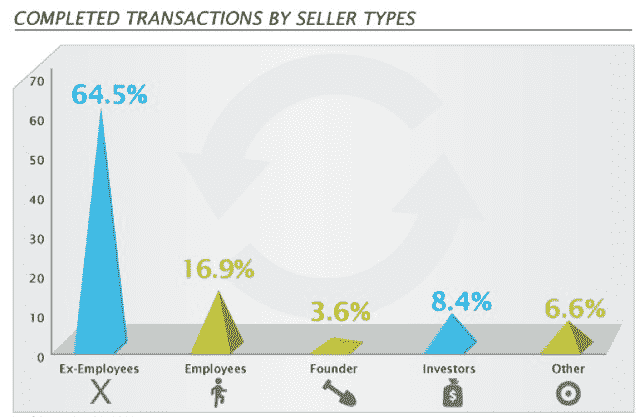
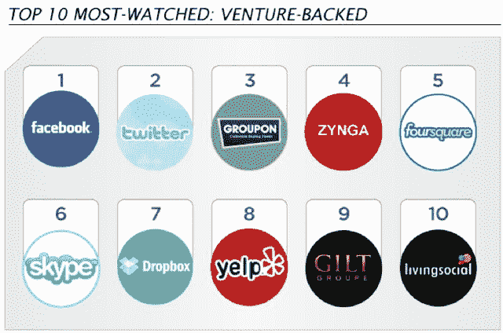
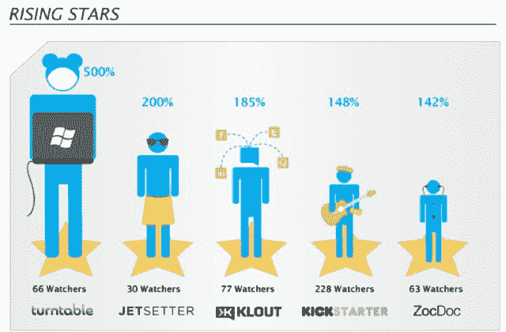
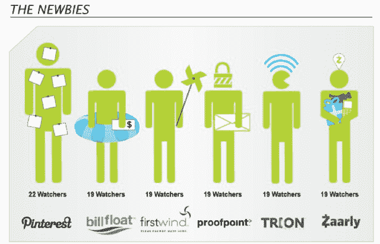

# second market TechCrunch 上的私人股票交易今年增长了 73%

> 原文：<https://web.archive.org/web/http://techcrunch.com/2011/10/26/private-stock-transactions-up-73-percent-this-year-on-secondmarket/>

# 二级市场的私人股票交易今年增长了 73%

尽管 Groupon 和 Zynga 等一些知名公司排队等待 IPO，但另类交易所对私营公司股票的需求仍在上升。2011 年前三个季度，SecondMarket 上的私人股票交易总额为 4 . 35 亿美元，比去年同期增长了 73%。仅在第三季度，SecondMarket 上就有价值 1.67 亿美元的交易，比[第二季度](https://web.archive.org/web/20230203154304/https://techcrunch.com/2011/07/26/secondmarket-vc-scoreboard/)增长了 49%。

谁在购买所有这些股票？SecondMarket 在其[第三季度报告](https://web.archive.org/web/20230203154304/https://www.secondmarket.com/discover/uncategorized/q3-2011-private-company-report)中披露了这一点。富有的“合格个人”占买家的最大份额(按美元金额计算为 63%)，其次是资产管理公司(占交易的 22.3%)、对冲基金(7.8%)和风险资本基金(5.1%)。本季度，风险投资基金在 SecondMarket 上变得更加活跃，占交易数量的 17.5%。上个季度，风险投资在交易中的占比不到 1%(按金额计算，仅占 0.2%)。

在卖方方面，前雇员占了已完成交易的大部分(64.5%)。但目前的员工以 16.9%的交易量位居第二，几乎是第二季度交易量 4.4%的四倍。投资者卖出的交易数量翻了一番，达到 8.4%，这表明二级市场正在成为当前员工和股东更容易接受的流动性阀门。创始人代表的交易量最小，为 3.6%，但比上一季度的 1.9%有所上升。

SecondMarket 还追踪其服务中“最受关注”的公司，这表明了投资者的兴趣。最受关注的公司与上个季度相比没有变化:(脸书、Twitter、Groupon、Zynga、Foursquare、Dropbox 等。).但是有一群新的“明日之星”其中包括转盘、Jetsetter 和 Klout。在这些冉冉升起的新星之下是“新手”:Pinterest、Billfloat、Firstwind、Proofpoint 和 Zaarly。嗯，在 SecondMarket 上，一家公司受到的压力和人们的兴趣之间有关联吗？

