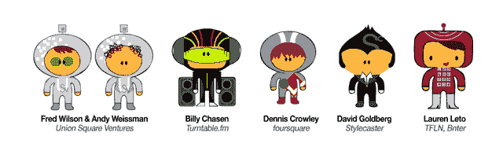

# 用转盘提升 Cache 纽约团队。fm: Crowley，Wilson & Weissman In The House TechCrunch

> 原文：<https://web.archive.org/web/http://techcrunch.com/2011/10/26/raise-cache-nyc-teams-with-turntable-fm-crowley-wilson-weissman-in-the-house/>

# 提高缓存纽约团队与转盘。调频:克劳利，威尔逊和韦斯曼在房子里

谈到创业中心，硅谷仍然是王者，但纽约至少在一个领域有优势:为美好的事业享受美好时光。

在这种情况下，活动是[筹集缓存](https://web.archive.org/web/20230204224754/http://raisecache.com/)，它希望为 [hackNY](https://web.archive.org/web/20230204224754/http://hackny.org/a/) 筹集 10 万美元，这是一个由哥伦比亚大学和 NYU 大学教师发起的组织，旨在刺激纽约市的创新。

今天，他们宣布 Raise Cache 与热门初创公司 [Turntable.fm](https://web.archive.org/web/20230204224754/http://www.turntable.fm/) 合作，在纽约州立军械库的一场派对/时装秀上，在纽约科技界一些知名人士的帮助下，将社交 DJ 网站带入生活。该活动将于 11 月 17 日举行，门票现已在 Eventbrite 发售，普通门票 70 美元，学生门票 30 美元。所有收益将捐给 HackNY，你可以在下面的视频中了解更多。

Turntable.fm 的创始人比利·蔡森(Billy Chasen)将制作一些混音(当然)，其他嘉宾 DJ 将包括 Foursquare 的创始人丹尼斯·克劳利(Dennis Crowley)、Union Square Venture 的弗雷德·威尔逊(Fred Wilson)和安迪·韦斯曼(Andy Weissman)、TFLN/Bnter 的创始人劳伦·勒托(Lauren Wilson)和 Stylecaster 的创始人大卫·戈德堡(David Goldberg)。因为它是由转盘驱动的，派对的客人可以通过他们的手机投票。

该活动还将包括一场时装秀，由各种技术人士主演，在 t 台上展示他们的东西。唉，出于我无法理解的原因，我没有被要求昂首阔步。

另一个有趣的转折:如果你还记得来自 TC Disrupt NYC(一个教孩子如何画画的教育应用程序)的 [Everything Butt Art](https://web.archive.org/web/20230204224754/https://techcrunch.com/2011/05/24/everything-butt-art/) ，该公司的插画师亚历克西斯·莫尼耶洛(Alexis Moniello)正在绘制每位嘉宾 DJ 的巨型俏皮画像(你可以在下面看到其中一些)。

【YouTube = ' http://www . YouTube . com/watch？v =-9Aan-_ cUb4 ']

