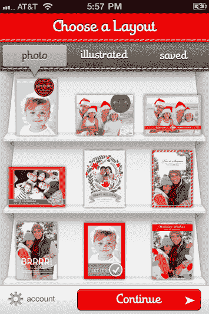

# 真诚地筹集 300 万美元，在途中发送真实世界的明信片、节日贺卡 TechCrunch

> 原文：<https://web.archive.org/web/https://techcrunch.com/2011/10/26/sincerely-raises-3-million-to-deliver-real-world-postcards-holiday-cards-on-the-way/>

# 真诚地筹集了 300 万美元来运送现实世界的明信片和节日贺卡

多亏了像 iCloud 和 Google+这样的服务，如今快照就像水一样在移动设备和网络之间流动。但是这些照片中的许多从来没有从像素跳到纸上。事实证明，人们仍然喜欢在家里的冰箱上贴照片和卡片。

这就是[真诚](https://web.archive.org/web/20230203125732/http://www.sincerely.com/)的用武之地。该公司生产的产品围绕着以低成本轻松创建和发送真实世界的明信片。今天它宣布筹集了 300 万美元的首轮融资，由 Spark Capital 牵头，Spark 的 Bijan Sabet 加入了董事会。该轮的其他参与者包括一个强大的投资者名单:第一轮资本，查尔斯河风险投资公司，SV 天使，Chamath Palihapitiya，德鲁休斯顿，保罗 Buchheit，亚当史密斯，Ariel Poler，Shan Sinha 和保罗弗里德曼。

到目前为止，真诚已经建立了三个产品。第一个是 [Postagram](https://web.archive.org/web/20230203125732/https://techcrunch.com/2011/04/12/postagram/) ，这是一个适用于 Android 和 iOS 的应用程序，可以让你用手机相机拍照，并快速给朋友和家人发送明信片。第二个是“真诚之船”,这是一个 iOS 库，可以让其他开发者快速将类似 Postagram 的功能植入到他们自己的应用中。

最后，真诚今天宣布一个新产品:真诚墨水，它将让你使用你自己的照片创建和发送个性化的节日贺卡，这些照片可以插入 40 个专业设计的模板之一。这些节日贺卡的起价为每张 1.69 美元，包括邮资，并将印在 5×7 英寸的明信片上。如果这符合你的口味，前 200 名在 www.sincerely.com/ink注册的代码为“TC”的人将可以免费发送他们的第一张节日贺卡。这款应用目前还没有发布，但很快就会发布 iOS 和 Android 版本。

当然，现在真诚有了另一个非常大的竞争对手:苹果。该公司推出了 iOS 版的*卡片*应用程序，它还可以让你向朋友和家人发送真实世界的~~明信片~~凸版贺卡。不过，苹果的产品要贵得多——向美国人发送贺卡收费 2.99 美元，向世界任何地方发送贺卡收费 4.99 美元。Postagram 的价格？标准明信片 99 美分，贺卡 1.69 美元。

