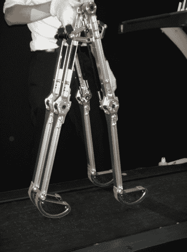

# 视频:这个机器人正在自己行走(不使用马达或电力)

> 原文：<https://web.archive.org/web/http://techcrunch.com/2011/10/26/video-this-robot-is-walking-on-its-own-without-using-motors-or-electricity/>

# 视频:这个机器人正在自己行走(不使用马达或电力)

我们离机器人时代又近了一步:[名古屋理工学院](https://web.archive.org/web/20230204095457/http://www.nitech.ac.jp/eng/)的一个研究小组已经开发出一种能够自己行走的被动[机器人](https://web.archive.org/web/20230204095457/https://techcrunch.com/tag/robots)。只需轻轻一推，它就能动起来——不需要马达、传感器甚至电力。它的腿和脚踝仅由势能驱动。

制造商表示，该机器人由铝制成，在一次测试中连续走了 10 万步(持续了 13 个小时)。该机器人能够携带“10-20 公斤”的有效载荷，例如，可以供行走困难的人使用(人类可以将机器人“穿”在腿上)。

该机器人高 90 厘米，行走速度为 3.3 公里/小时。商业版本有望在 1-2 年内上市。

这段来自 [Diginfo TV](www.diginfo.tv/2011/10/25/11-0217-r-en.php) (东京拍摄，英文)的视频展示了机器人在行动:
【YouTube = http://www . YouTube . com/watch？v = rhu 2 xnipgde&w = 560&h = 315】