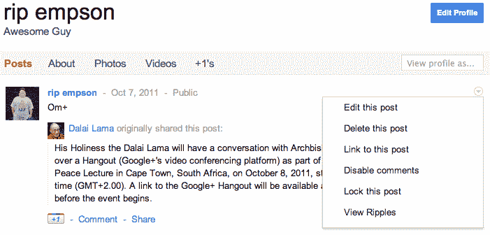
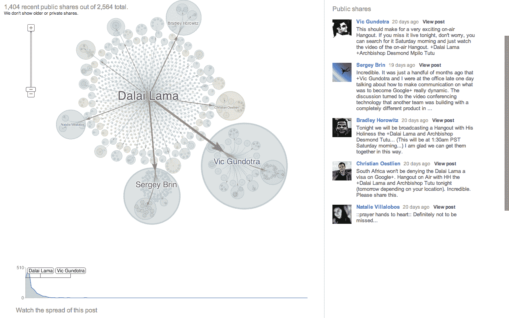

# Google+恢复 Wave 的播放功能，将其重命名为“涟漪”

> 原文：<https://web.archive.org/web/http://techcrunch.com/2011/10/27/google-resurrects-playback-feature-from-wave-renames-it-ripples/>

去年八月，[谷歌要求我们所有人向 Google Wave](https://web.archive.org/web/20230204224000/https://techcrunch.com/2010/08/04/wave-goodbye-to-google-wave/) 说再见。有些人说 Wave 是超前的，有些人说这个平台有足够的功能来击沉泰坦尼克号。然而，谷歌今天宣布了其社交网络 Google+的一些重大更新，其中之一是[谷歌应用程序用户现在可以注册 G+](https://web.archive.org/web/20230204224000/https://techcrunch.com/2011/10/27/google-apps-users-can-now-hangout-and-more-on-google/)——集成终于上线了。

今天在 Google+上推出的其中一项功能似乎是对 Google Wave 现已废弃的一项功能的回归，名为“回放”。或者至少有人会声称这是它的起源，这个功能源于内部，而不是对今年 9 月推出的[脸书的非常华丽的时间轴](https://web.archive.org/web/20230204224000/https://techcrunch.com/2011/09/22/facebook-timeline-pictures/)的某种反应。

是的，今天，谷歌推出了新的 Google+涟漪，这将让用户“重现”他们使用 Google+历史上发生的对话、评论和分享。点击这里查看谷歌的博客文章。

换句话说，涟漪是一个“公共分享和评论的可视化工具”，用户只需在公共帖子右侧的下拉窗口中选择“查看涟漪”选项即可访问。

从那里，Google+弹出一个新的标签，用户可以在一个漂亮的图形界面中看到活动，放大特定的事件——看到所有事情的内在联系。根据涟漪的描述，该图显示了当其他用户分享帖子时帖子在网络上的传播，箭头“指示重新分享的方向”，圆圈内的圆圈代表“重新分享的顺序”，较大的圆圈指示最重的分享(和分享者)。

用户还可以看到分享帖子的人的反馈，并在移动的时间线上点击播放，显示帖子传播的速度以及在几天、几个月、几周和几年内的分享程度。

根据谷歌的博客帖子，这里的目的是当一个人分享他们的帖子时“重新点燃最初的兴奋”，并更好地了解帖子是如何在网络上流动的，以及它曾经(和现在)获得了什么样的影响和集体观看。

谷歌表示，Ripples 仍处于试验阶段，正在寻求反馈，以了解它如何能够提供更多信息和“更棒”。但到目前为止，一切顺利。而且，要明确一点:是的，谷歌的确以我的名字命名了这项功能。谢谢你，谷歌。

但有趣的是，Google Ripples 与 Google Wave 的“回放”功能非常相似，后者允许朋友了解 Wave 中其他人已经在谈论的内容。这基本上就像倒带波，看看过去发生了什么，有能力通过它的许多变化来观察它的进展。回放允许用户跳来跳去，并随着时间的推移依次看到所有的编辑，以消除功能丰富的交流平台的一些混乱。

今天宣布的另一个值得注意的更新是所谓的“Google+ Creative Kit”，在某种程度上有点像 Instagram 滤镜的升级版。Creative Kit 允许以更深入的方式编辑 G+上的照片，使用户能够锐化他们的照片，添加文本，裁剪，旋转，调整大小，或覆盖现在经常与 Instagram 和 Hipstagram 联系在一起的复古外观。(或者正如一位评论者和谷歌工程师所指出的，Creative Kit 似乎是谷歌去年收购的照片编辑初创公司[的](https://web.archive.org/web/20230204224000/https://techcrunch.com/2010/03/01/google-buys-up-online-photo-editing-site-picnik/) [Picnik](https://web.archive.org/web/20230204224000/http://www.picnik.com/) 的原生集成。)根据谷歌的说法，使用 Creative Kit 所需要的只是“一个想法”:

http://youtu.be/RipLoAUUDjc

本着万圣节的精神，谷歌在 Creative Kit 中添加了一些限时的“幽灵”功能，并推出了一个摄影比赛(直到 10 月底)，用户可以在 Google+上用标签“#gplushalloween”分享他们令人恐惧的照片。一个名人评委小组将选出他们最喜欢的照片，甚至可能颁发奖品。虽然我们正在检查最后一点。

Ripples、Creative Kit 和 Google Apps integration 无疑是 Google+平台的显著增强，尤其是后者已经成为数百万 Google Apps 用户迫切需要的功能。照片编辑功能也是一个额外的好处，考虑到自推出以来，Google+用户已经向该平台添加了超过[34 亿张照片。虽然基本的照片编辑工具已经可用，但 Creative Kit 将 Google+的编辑选项提升到了一个新的水平。](https://web.archive.org/web/20230204224000/https://techcrunch.com/2011/10/19/over-3-4-billion-photos-have-been-shared-on-google-in-the-past-100-days/)

此外，就进一步缩小与脸书之间的差距而言，作为一个内容共享媒体，涟漪是 Google+的自然补充。涟漪和脸书即将到来的时间线都是展示我们社会数据的独特视觉方式。Timeline 将允许用户用按时间顺序排列的剪贴簿取代他们的个人资料，跟踪你“最重要”的照片、分享的内容、应用程序等，追溯到你出生的那一天(照片)，或加入脸书的那一天(其他一切)。

Ripples 有一个稍微不同的用例，因为它旨在让用户直观地看到他们的内容共享的涟漪效应、共享的方向性以及给定主题的受欢迎程度。这两个都是漂亮的视觉功能，但尽管时间轴似乎不仅有可能在深层次上改变你的脸书和社交足迹，但涟漪并没有达到这一点。它有潜力成为一个很酷的数据可视化媒介，这一点谷歌绝对是最棒的。但是，实际上，问题变成了:你实际上会使用多少波纹？而且，既然归根结底都是钱的问题，那么哪个对品牌和未来的货币化更有价值？

关于这些 Google+新功能的更多信息，[这里是博客文章](https://web.archive.org/web/20230204224000/http://googleblog.blogspot.com/2011/10/google-popular-posts-eye-catching.html)。