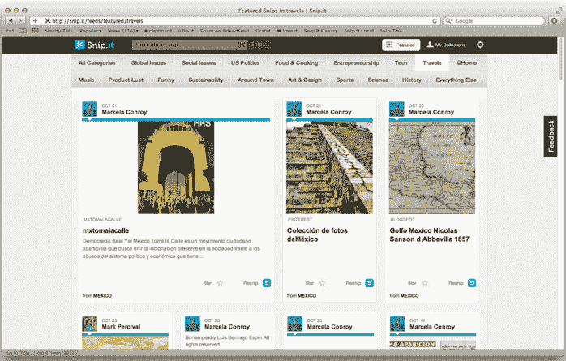

# Khosla Ventures 支持的 Snip .它可以让你在网上剪辑、保存和分享内容集合 TechCrunch

> 原文：<https://web.archive.org/web/http://techcrunch.com/2011/10/27/khosla-ventures-backed-snip-it-lets-you-clip-save-and-share-collections-of-content-on-the-web/>

# Khosla Ventures 支持的 Snip .它可以让你在网上剪辑、保存和分享内容集合

Snip.it 是一家让你在网上创建和分享内容集合的初创公司，已经获得了来自科斯拉风险投资公司、True Ventures、查尔斯河风险投资公司和 SV Angel 的一轮融资。虽然这项服务仍处于私人测试阶段，但 TechCrunch 的读者可以在这里使用邀请代码“techcrunch_500”来使用 Snip.it。

Snip .它让你创建内容和观点的集合(称为“snip”)，并与任何人或每个人分享。Snip .它允许你把对你重要的内容放在一个地方，加入你的声音，从志同道合的人那里发现有趣的内容。这有点像书签遇到内容收集遇到自我表达遇到发现。这家初创公司允许你从网上收集内容，用一个人的声音对其进行个性化处理，还可以发现内容。

通过 Bookmarklet，您可以轻松地从任何站点截取内容，这些内容将被导入到您的 Snip.it 集合中。然后你可以组织你的截图，发布或者私下分享。你可以用描述和评论来编辑你的收藏。

在分享和发现方面，你可以通过链接将你的收藏分享给脸书。在 Snip.it 上，你可以订阅某些主题(如美国政治、科技)，以发现更多收藏。

SnipIt 是前 TellMe 工程师 Ramy Adeeb 的[创意，他也是 Khosla Ventures 的负责人。Adeeb 告诉我，他在今年早些时候发生的](https://web.archive.org/web/20230203062918/http://www.readwriteweb.com/archives/inside_top_tellme_engineers_new_bookmarking_startu.php)[埃及抗议](https://web.archive.org/web/20230203062918/https://techcrunch.com/2011/01/27/egypt-situation-gets-worse-people-reporting-internet-and-sms-shutdown/) (Adeeb 来自埃及)后不久就创办了这家初创公司。他在 Twitter 和脸书上看到了一些报道，但没有能力在一个地方管理和分享所有这些内容，也没有能力添加意见。

他着手创建一个他称之为“所有对我来说重要的东西的剪贴簿”，于是 SnipIt 诞生了。到目前为止，在私人测试中，他说结果是积极的。在一个由数百名用户组成的群组中，已经共享了 10，000 个剪辑。

与 Pinterest 类似， Snip .它提供了一种以社交和可发现的方式管理内容的方式。它可以让你在浏览网页时相对容易地剪切网页内容，并将其导入到你的内容中。

[YouTube http://www.youtube.com/watch?v=IfzZgGDbPGk&w=560&h=315]