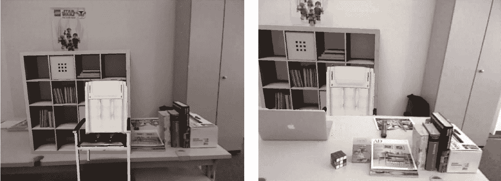

# Metaio 为他们的增强现实平台 TechCrunch 增加了引力

> 原文：<https://web.archive.org/web/http://techcrunch.com/2011/10/27/metaio-adds-gravity-to-their-augmented-reality-platform/>

# Metaio 为他们的增强现实平台增加了重力

德国增强现实公司 [Metaio](https://web.archive.org/web/20230205033922/http://www.metaio.com/) 今天在[举行的今年 ISMAR 会议](https://web.archive.org/web/20230205033922/http://www.ismar11.org/)上展示了他们核心技术的一些更新。该公司正在记录这一更新，从一些高度技术性的白皮书中摘录，谢天谢地，还有一些视频演示(对于像我这样的算法受到挑战的人)。

对其核心增强现实能力的这一更新的基本要点是，该公司已经能够在 3 个方面创造 AR 技术进步:

*   重力意识
*   识别 3D 物体的能力
*   [虚拟对象的遮挡](https://web.archive.org/web/20230205033922/http://dictionary.reference.com/browse/occlude)(例如，当观看空间中的真实对象经过虚拟对象前面时，虚拟对象变得不可见或被遮挡，就像真实对象一样)

 没什么大不了的对吧？我们在电子游戏中看到重力和遮挡效果已经很多年了？我们上周发布的[微软演示](https://web.archive.org/web/20230205033922/https://techcrunch.com/2011/10/21/microsofts-augmented-reality-3d-holodesk-lets-you-play-with-balls-in-real-time/)简单而优雅地演示了关于增强虚拟物体的重力和遮挡。我认为 Metaio 的这一更新意义重大的原因是，他们能够在可变光照和多种环境下实时进行跟踪。他们能够在单一、封闭或完全受控的空间之外提供这种重力敏感的 AR 图像跟踪，这增加了在现实世界中使用的潜力。

这涉及到一些非常严肃的数学问题，所以当白皮书最终在 metaio.com 发布时，请查看更多细节。如果你和我一样，就看视频，对着闪亮的物体微笑。

【YouTube = http://www . YouTube . com/watch？v = gvnicyeunc 0 & feature = player _ embedded]

【YouTube = http://www . YouTube . com/watch？v = 1 jfo 640 kpro & feature = player _ embedded]

我在 9 月份慕尼黑的 insideAR 会议上看到了遮挡功能的预览，所以请查看我自己的配套视频，看看他们是如何使用 Kinect 绘制深度和遮挡虚拟物体的。

更多信息见官方[新闻稿](https://web.archive.org/web/20230205033922/http://www.metaio.com/press/press-release/2011/metaio-to-showcase-its-core-technologies-for-an-augmented-world-at-ismar-2011/)