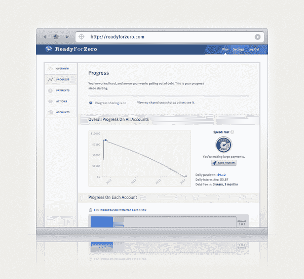

# 就像给负债者的造币厂:ReadyForZero 现在支持抵押贷款 TechCrunch

> 原文：<https://web.archive.org/web/http://techcrunch.com/2011/10/27/mint-for-people-in-debt-readyforzero-adds-support-for-loans-to-its-debt-management-service/?utm_source=dlvr.it&utm_medium=twitter>

y Combinator alum[ReadyForZero](https://web.archive.org/web/20230203163248/https://www.readyforzero.com/)今天推出了债务管理服务的升级版，新功能将允许用户使用其在线应用程序集中管理更多债务。此前，该公司只专注于减少消费者的信用卡债务。现在它也增加了对抵押贷款、汽车贷款和学生贷款的支持。

乍一看， [ReadyForZero](https://web.archive.org/web/20230203163248/https://www.readyforzero.com/) 可能会被误认为是在线资金管理服务 [Mint](https://web.archive.org/web/20230203163248/http://www.crunchbase.com/product/mint) 的竞争对手。但是 Mint 帮助你洞察你的消费行为，ReadyForZero 更专注于帮助你积极偿还债务。像 Mint 一样，它自动从你的银行账户、信用卡账户和现在的贷款中导入数据，但它使用这些信息主动提出建议，告诉你什么时候可以额外付款，以节省利息。它还可以提醒你，最近的大额购买将对你在给定时间内偿还债务的计划产生影响，并可以建议你回到正轨的方法。

然而，更重要的是，这一制度行之有效。正如 MG [今年夏天](https://web.archive.org/web/20230203163248/https://techcrunch.com/2011/06/14/readyforzero-funding/)报道的那样，ReadyForZero 服务的固定用户摆脱债务的速度是非固定用户的两倍。

除了上面提到的对贷款管理的支持，ReadyForZero 的用户界面也进行了调整，增加了一些新功能，比如一个“速度”小工具，它可以显示你通过额外付款偿还债务的速度有多快。该工具旨在帮助您更好地可视化您对付款计划所做的调整。

该网站现在还包括新的建议操作，让你完成任务，如设置付款提醒以与你的日历同步或链接你的帐户等。

“分享你的进展”功能也已经扩展，所以你可以提供一个匿名的网址，向需要证明你努力的贷款人和银行提供你减债进展的快照。

据联合创始人罗德·易卜拉希米称，这家初创公司已经收到了五大银行中两家的消费者债务咨询。银行想知道如何利用这项服务来帮助他们的客户重组债务，从而降低银行的风险。易卜拉希米解释说，在任何时候，这些银行都有 10%的债务处于风险之中。或者换句话说，数百亿美元。

ReadyForZero 现在正与其中一些银行机构合作，测试这项服务如何为其用户提供银行自己的产品和程序，帮助他们进一步减少债务。路线图上还有自动化支付和一系列移动应用的计划。

今年 6 月，ReadyForZero 在首轮融资中筹集了 450 万美元，由北极星风险投资公司(Polaris Venture Partners)牵头，花旗风险投资公司(Citi Ventures)参与其中。在此之前，[、260，000 美元的种子轮](https://web.archive.org/web/20230203163248/https://techcrunch.com/2010/10/28/readyforzero-raises-260k-to-help-cleanse-consumers-of-credit-card-debt/)邀请了著名的天使投资人，如、[戴夫·麦克卢尔](https://web.archive.org/web/20230203163248/http://www.crunchbase.com/person/dave-mcclure)、[本杰明·林](https://web.archive.org/web/20230203163248/http://www.crunchbase.com/person/ben-ling)、[尼尔斯·约翰逊](https://web.archive.org/web/20230203163248/http://www.crunchbase.com/person/nils-johnson)和[曼尼希·阿罗拉](https://web.archive.org/web/20230203163248/http://www.linkedin.com/in/maneesharora)。