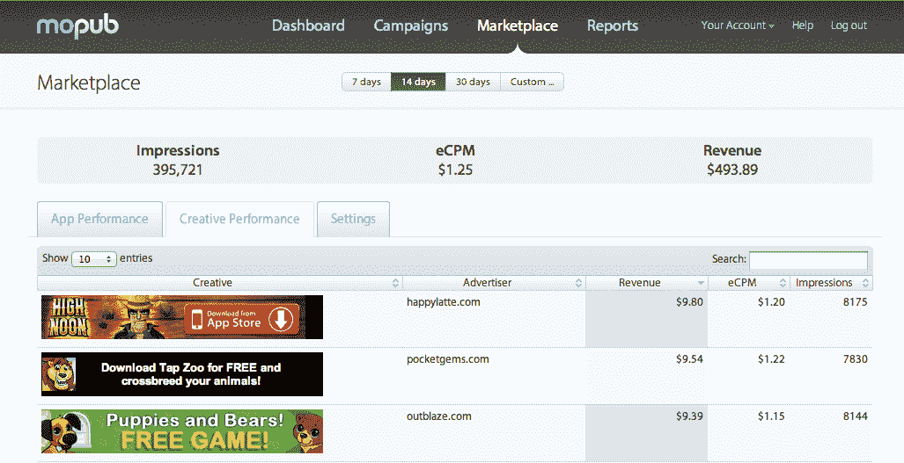

# MoPub 推出新的实时移动广告竞价市场 TechCrunch

> 原文：<https://web.archive.org/web/http://techcrunch.com/2011/10/27/mopub-launches-new-marketplace-for-real-time-mobile-ad-bidding/?utm_source=dlvr.it&utm_medium=twitter>

由前 AdMob 和谷歌员工创办的移动广告初创公司 MoPub T1，迄今为止一直被称为移动广告的 T2 双击。如今，该公司正在扩大其产品，推出了 [MoPub Marketplace](https://web.archive.org/web/20230203101819/http://www.mopub.com/marketplace) ，这将成为移动广告的虚拟交易平台，允许应用发布商与广告买家实时联系。

该市场将作为一个自助服务平台运营，允许出版商获得新的收入来源，同时仍保持对其移动广告库存的控制。联合创始人兼首席执行官吉姆·佩恩解释说，新的实时市场可以做广告网络不能做的事情，这相当于一种“黑匣子”，出版商不能控制他们购买的东西或以任何真正的复杂性为目标投放广告。

要使用这项新服务，iOS 和 Android 开发者可以下载更新的 SDK，MoPub 平台上已经有超过 650 家出版商在使用它。例如，一旦安装完毕，出版商就能获得关于哪些广告创意人员正在工作以及他们工作情况如何的详细信息。未来，MoPub 将开始提供更精细的细节，包括每小时的广告库存分析。

在[市场](https://web.archive.org/web/20230203101819/http://www.mopub.com/marketplace)中，发行商也可以选择向竞标者展示或隐藏他们的应用程序名称，并可以先发制人地屏蔽来自特定广告商或品牌的广告，如竞争对手的广告。他们甚至可以屏蔽特定的广告本身。

虽然还有其他实时市场——[NEX age 的](https://web.archive.org/web/20230203101819/http://www.crunchbase.com/company/nexage)解决方案相当完整，佩恩说——MoPub 希望通过成为出版商的一站式商店来脱颖而出。它的全部产品线现在包括直接销售广告、交叉促销活动、广告网络，以及由于 Marketplace 的推出，实时竞价，所有这些都在一个地方。

该市场的试点项目之前在邀请的基础上与大约 10%的用户群(65 个出版商)进行了测试。现在，任何感兴趣的出版商都可以在这里免费注册。

MoPub [已经从 Accel Partners 和 Harrison Metal Capital 获得了超过 650 万美元的风险投资。这笔资金用于市场开发和增加员工人数，目前在旧金山和纽约有 30 人，大部分是工程师(还在增加)。](https://web.archive.org/web/20230203101819/https://techcrunch.com/2010/12/06/mopub-funding/)

