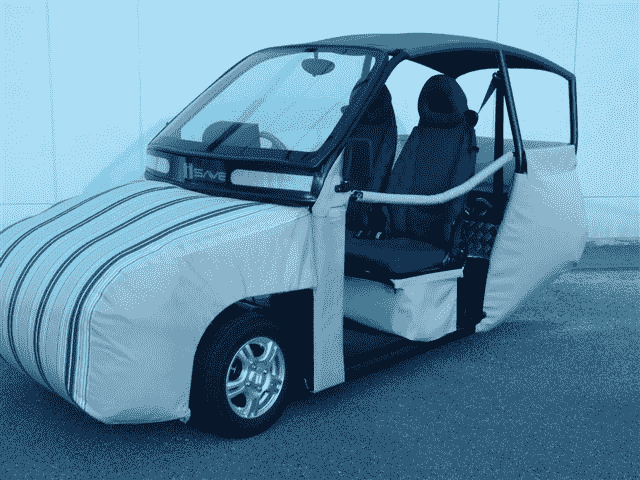
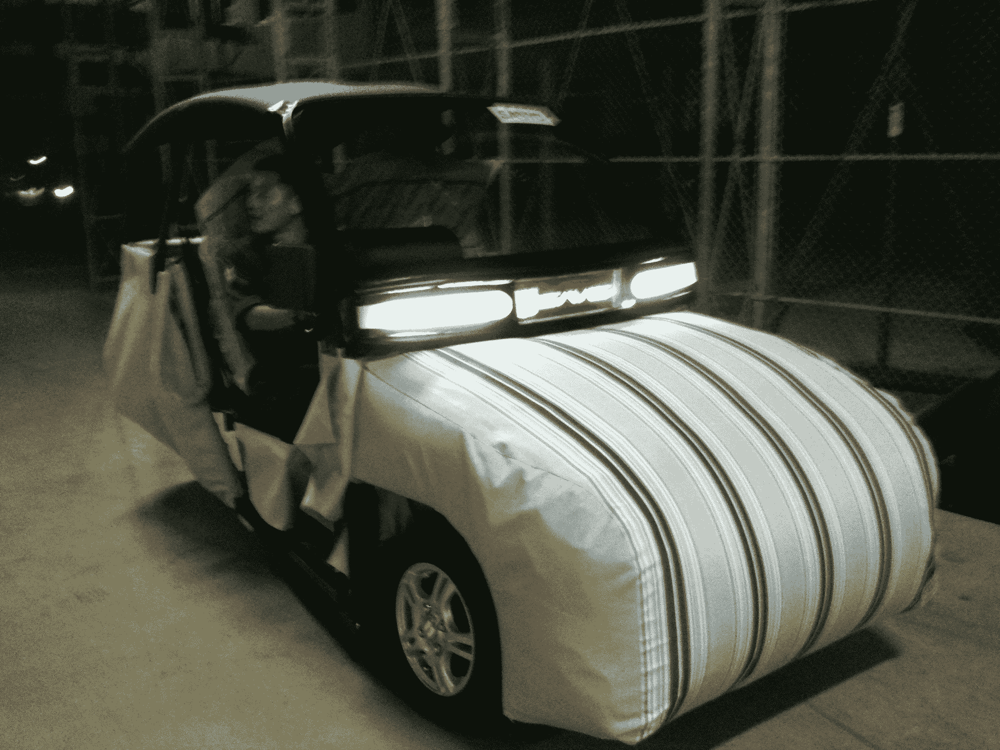

# 视频:这款电动汽车“佩戴”安全气囊，提供终极保护 TechCrunch

> 原文：<https://web.archive.org/web/http://techcrunch.com/2011/10/27/video-this-electric-vehicle-wears-airbags-for-ultimate-protection/>

# 视频:这款电动汽车“穿”上安全气囊，提供终极保护

一家名为[Humanix](https://web.archive.org/web/20230203064353/http://humanix.jp/)【JP】的日本公司，与[广岛大学](https://web.archive.org/web/20230203064353/http://www.hiroshima-u.ac.jp/index.html)合作，研发出一款可以在身上“穿”安全气囊的小型电动汽车。我真的不确定这个结果是否可以被称为漂亮，但 Humanix 声称(也许是理所当然地)他们的“iSAVE-SC1”是“世界上最安全的电动汽车”。

这款三轮汽车为三个人提供了足够的空间，前后都有充气气囊，车身覆盖着帐篷布。在碰撞时，从袋子中释放的空气会减弱冲击力。

 

iSAVE-SC1 的最高时速约为 50 公里，可以使用传统的 100 伏电源插头充电。

Humanix 计划在明年某个时候开始“大规模生产”之前，在 11 月份以 10，400 美元的价格出售第一批汽车(仅在日本)。该公司还于今年 4 月在旧金山成立了一家美国公司。

这个视频是去年的，不过你会有想法:
【YouTube = http://www . YouTube . com/watch？v = wo 0 qk XB 8 LQ 8&w = 560&h = 315】