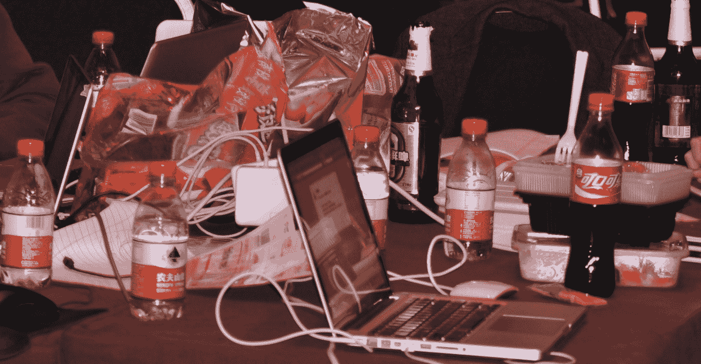
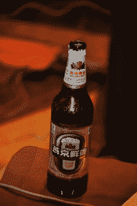
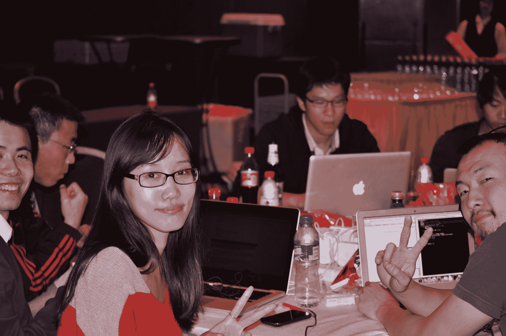
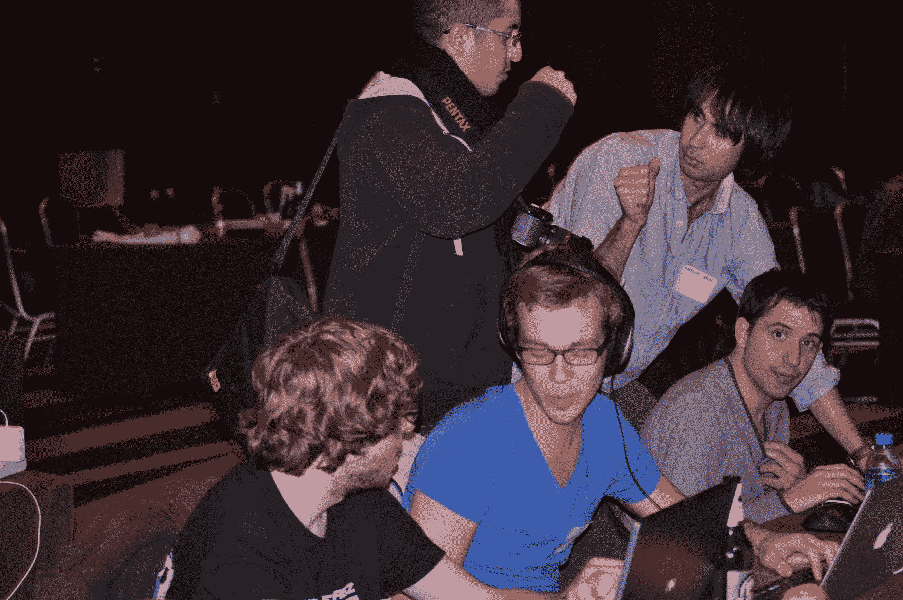
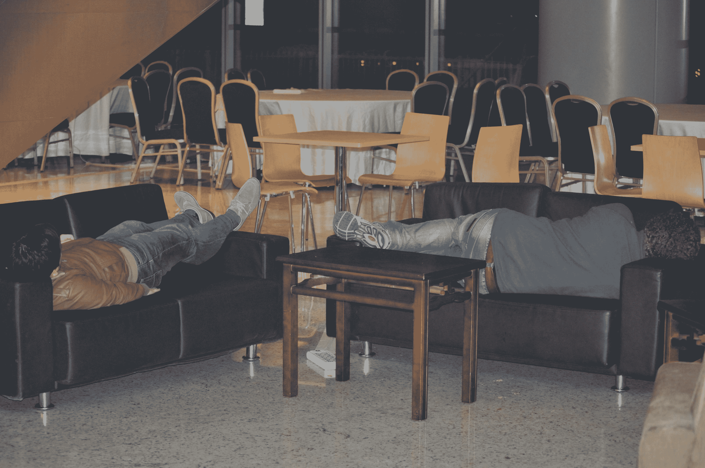
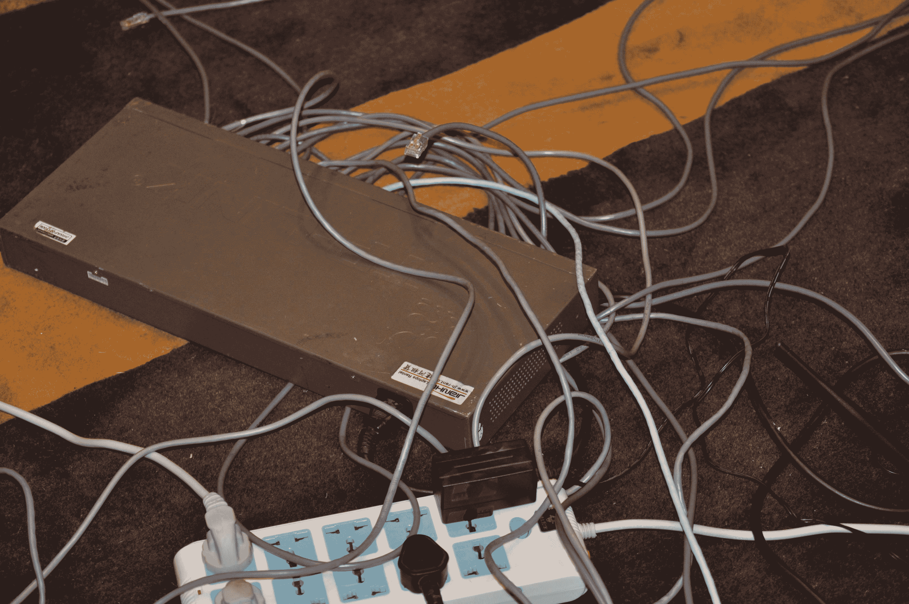
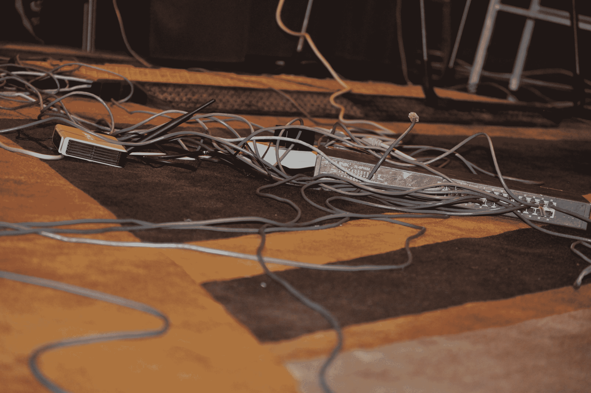
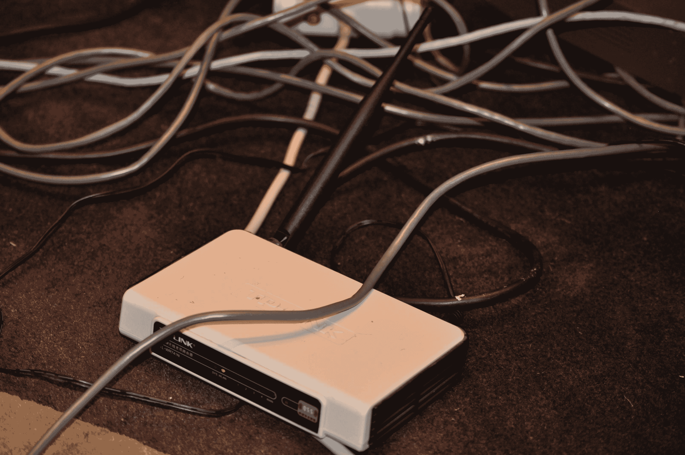
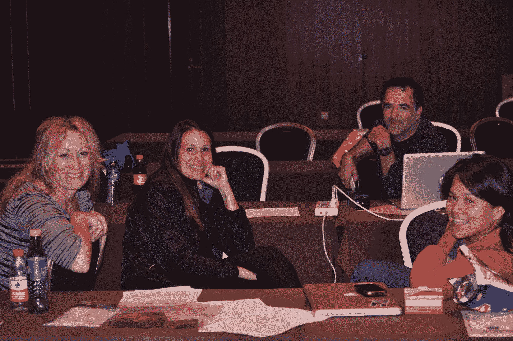

# 北京黑客马拉松 TechCrunch 的深夜场景

> 原文：<https://web.archive.org/web/http://techcrunch.com/2011/10/29/late-night-scenes-from-the-beijing-hackathon/>

[扰乱北京黑客马拉松](https://web.archive.org/web/20230205044418/https://techcrunch.com/2011/10/29/sort-of-live-from-the-beijing-hackathon-we-talk-to-the-hackers/)已经进入黑夜的黑暗时刻。

在一些午夜意大利面条、(真正的)加糖可乐、清爽的燕京啤酒和意大利红肉风味品种(奇怪的味道像烧烤)的刺激下，我们的[勇敢的黑客](https://web.archive.org/web/20230205044418/https://techcrunch.com/2011/10/29/meet-the-disrupt-bj-hackathon-hackers)正在以极快的速度启动代码。这里很安静，但桌子上有明显的嗡嗡声。尽管偶尔会有黑客为了享受动物般的舒适，比如睡个好觉而离开，但许多人都留了下来，注意力和意识水平似乎都很高。

今天不是一帆风顺的。我们有互联网和 Wi-Fi 连接问题，但在真正的黑客时尚中，工作人员和支持人员已经拼凑了一些东西。只是。工作。你会在下面的图片中看到。

以下是我凌晨 3 点在房间里拍照的一些场景。

**燃料**

**人民**

我们已经让黑客们微笑着准备好了……

那些在这个时候可能需要的人…

一群法国黑客正在进行一场听起来很愉快的技术对话，而其中一人，赫尔墨斯(根据他的名字标签)，正在大声播放着令人敬畏的说唱音乐..

**昏昏欲睡的黑客**

当然，没有必不可少的瞌睡黑客照片，任何黑客马拉松照片集都是不完整的。

这让我想起了我的研究生时代。在实验室里排好三把椅子打瞌睡的舒适……

然而就在房间外面，我们发现两个黑客似乎已经屈服并全力以赴了！

**电报之战**

现在，为了证明我们与 Wi-Fi/互联网之神的史诗般的战斗。互联网连接一整天都很不稳定，这个大房间里的 Wi-Fi 很早就坏掉了。几个小时后，这就是我们的结局。够好吗？当然可以。好玩？不确定。

一个布线密集的开关，电缆连接到每张桌子…

房间里到处都是杂乱的电缆…

但是，总的赢家是这个孤独，悲伤的路由器，有两个闪烁的灯和一个天线。他努力抗争。他是个骑警。

最后，但同样重要的是，TechCrunch 团队的一员，虽然很累，但面带微笑。

黑客马拉松的提交将于北京时间上午 8 点开始，演示将于上午 11 点开始。敬请关注我们将现场直播此次活动！