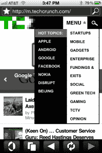

# 新的 iOS 版 MobiUs 浏览器让移动网络应用更像本地应用 TechCrunch

> 原文：<https://web.archive.org/web/http://techcrunch.com/2011/10/30/new-mobius-browser-for-iphone-makes-mobile-web-apps-act-more-like-native-apps/?utm_source=feedburner&utm_medium=feed&utm_campaign=Feed%3A+Techcrunch+(TechCrunch>)

移动开发公司 appMobi 将于周一发布一款新的基于 HTML5 的 iOS 浏览器，该浏览器将为移动网络带来通常只能在本地应用中找到的额外功能。被称为[的 MobiUs Web 应用浏览器](https://web.archive.org/web/20230203074401/http://www.appmobi.com/getMobius)，既可以作为独立的浏览器选择，也可以与苹果的 mobile Safari 配合使用，类似于浏览器扩展在桌面网络上的工作方式。

虽然 HTML5 已经可以接入智能手机的一些传感器，例如 GPS 和加速度计，但 appMobi 的 MobiUs Web 应用浏览器将超越 HTML5 的现有功能，提供访问智能手机的摄像头，扫描二维码和条形码的能力，支持增强现实，加速图形，锁定设备旋转的能力等等。

该浏览器集成了来自 appMobi 和 PhoneGap (1.0)的两套完整的 API，为 Web 应用程序提供了原生的外观和感觉，并能够访问智能手机的所有硬件功能。像本地应用一样，移动网络应用可以在线或离线工作，提供推送通知和应用内购买功能。AppMobi 的 DirectCanvas 游戏加速技术也包括在内，用于优化 HTML5 游戏。

appMobi 表示，用户不必为了利用新功能而放弃 Safari 浏览器。相反，当用户遇到需要 MobiUs 提供的功能的网页时，有问题的 Web 应用程序会提示您从 iTunes 安装 MobiUs iOS 应用程序。这种体验类似于在线用户被提示安装 Flash 插件来观看在线视频。除了在这种情况下，附加软件不是浏览器插件，而是一个应用程序。

初始安装后，任何未来需要 MobiUs 技术的网络应用程序都将能够根据需要从 Safari 无缝切换到 MobiUs，而无需任何用户干预。移动 Web 应用程序开发人员将能够在过渡期间配置影响用户体验的各种设置，包括闪屏的定制。而且 MobiUs 推出的时候会是全屏模式。

AppMobi 知道，最终，HTML5 将能够做它的 MobiUs 浏览器今天正在做的事情，但这些 API 在几年内不会被添加到标准中。其他解决方案，如 HTML5 功能芯片制造商[高通正在努力将其引入移动设备](https://web.archive.org/web/20230203074401/https://developer.qualcomm.com/develop/mobile-technologies/web-technologies/tools-and-resources)，在堆栈中的运行级别低于 appMobi 提供的，并将提供给原始设备制造商在新手机上销售。这是解决问题的另一种方式，但周期比 appMobi 现在做的要慢。

该公司有一些开发人员在发布前测试了这项技术，但不幸的是，我们无法亲自动手。对于最终用户来说，这种体验到底有多无缝，或者说这些应用程序到底有多“像本地人”还有待观察。然而，这次发布很有趣，因为它有可能给 Web 开发人员带来长期追求的“编写一次，在任何地方运行”的能力。现在，他们可以使用 HTML5 为桌面、脸书、iOS 以及即将到来的 Android 编写代码，而不必在将代码库移植到移动设备时牺牲太多功能。

默比乌斯的应用程序可以在[这里](https://web.archive.org/web/20230203074401/http://itunes.apple.com/us/app/mobius/id453823727?mt=8&ign-mpt=uo%3D4)获得。Android 版本将于明年初上市。

