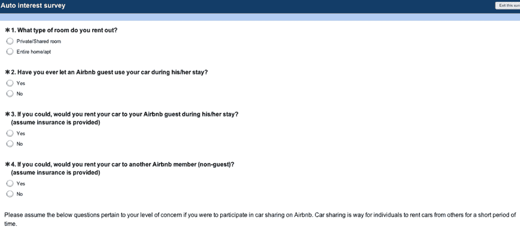
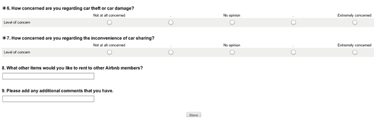

# Airbnb 正在考虑与汽车共享服务 TechCrunch 合作

> 原文：<https://web.archive.org/web/https://techcrunch.com/2011/10/31/airbnb-is-thinking-about-going-after-getaround-with-car-sharing-service/>

# Airbnb 正在考虑与汽车共享服务合作

Airbnb 是一个允许人们通过网络出租房屋和公寓的市场，它正在考虑进入汽车共享领域。在 Airbnb 房东发给我们的一份调查中，这家初创公司询问房东，他们是否会将自己的汽车和住所一起出租。

正如下面的截图所示，Airbnb 询问业主是否允许客人在住宿期间使用汽车，以及如果提供保险，业主是否会将汽车租给客人。该调查还询问主人，他们是否会把车租给不租他们房子的客人。

该调查还询问了车主在提供汽车共享服务时，他们对汽车失窃和不便的担忧程度。Airbnb 询问主人是否还有其他物品可以出租给客人。

顾客调查并不意味着 Airbnb 会很快推出汽车共享服务。但对于 Airbnb 来说，这是一个合乎逻辑的市场。特别是随着[新的巨额资金](https://web.archive.org/web/20230203065923/https://techcrunch.com/2011/07/24/airbnb-bags-112-million-in-series-b-from-andreessen-and-others/)，该服务可以利用这一点扩展到其他垂直市场。当然，这将是对最近在 TechCrunch Disrupt 上推出的汽车租赁社区(而[赢得了](https://web.archive.org/web/20230203065923/https://techcrunch.com/2011/05/25/and-the-winner-of-techcrunch-disrupt-nyc-is-getaround/))的 [Getaround、](https://web.archive.org/web/20230203065923/http://www.getaround.com/disrupt)的竞争。或者 Airbnb 可以直接收购 Getaround 或与之合作。

我们已经联系了公司进行确认。

更新:Airbnb 表示，它正在考虑与现有的汽车共享服务合作，并发布了以下回应:

*我们不断与用户互动，定期发送调查问卷并组织焦点小组，以更好地服务我们的社区。许多汽车共享公司有潜在的合作机会，因此我们发起了这项调查，以评估我们社区对汽车共享服务的兴趣以及合作关系是否对他们有用。*

