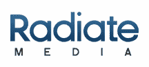

# 收购 NAVTEQ 广告集团后，Matchbin 成为辐射媒体；新增 2200 万美元融资 TechCrunch

> 原文：<https://web.archive.org/web/http://techcrunch.com/2011/11/01/after-acquiring-navteq-ad-group-matchbin-becomes-radiate-media-adds-22-million-in-financing/>

# 收购 NAVTEQ 广告集团后，Matchbin 成为辐射媒体；增加 2200 万美元的融资

为社区报纸、广播电台和电视台创建 CMS 解决方案和托管网站的公司 Matchbin 今天宣布，它已经收购了 [NAVTEQ](https://web.archive.org/web/20230205040243/http://www.navteq.com/) Media Solution 的广播电视集团。此次收购完成了硅谷银行 1200 万美元的信贷安排，并导致了 [Radiate Media](https://web.archive.org/web/20230205040243/http://radiatemedia.com/about-us) 的成立，该公司将为当地和全国广告商提供本地化内容、数字内容管理系统和广告平台等。

克里斯·路乞是 Traffic.com 的创始人，并在 2007 年被 NAVTEQ 收购之前上市(他后来成为 NAVTEQ 媒体解决方案的负责人)，他将成为 Radiate Media 的新任首席执行官，而 Matchbin 的前任首席执行官哈尔·维德兰斯基将成为 Radiate Media 的新任总裁和首席运营官。

Matchbin 今天还宣布，它已经完成了第一笔机构股权融资，由总部位于纽约的成长型股权投资者 Level Equity 牵头。Greycroft Partners 和 vSpring Capital 也作为联合投资者参与了这轮 1000 万美元的投资。

 Radiate Media 将利用 Matchbin 和 NAVTEQ 广播媒体集团的资源，通过与 NAVTEQ 的独家协议，继续向广播电视领域提供内容解决方案，并提供 Matchbin 的[“Editionals”](https://web.archive.org/web/20230205040243/http://matchbin.com/pages/mb_editionals)、面向媒体合作伙伴的以 iPad 为重点的 CMS 平台等解决方案，以及面向商家的目录发布平台和本地 SEO 优化网站。

NAVTEQ 媒体解决方案部门的成立是为了利用其母公司在数字地图方面的优势，该公司在过去十年中驱动了 6000 万台导航设备，为大型和小型出版商提供支持位置的广告网络和移动营销解决方案。

另一方面，自 2008 年 1 月推出以来，Matchbin 已经建立了超过 700 个稳定的本地媒体合作伙伴，累计网站流量超过 600 万独立访客。现在，与 NAVTEQ Media Solutions 的广播和电视广告集团合作，新成立的 Radiate Media 可以向媒体合作伙伴提供一系列网络和移动内容应用程序和服务，这些应用程序和服务反过来将为商家提供本地化的数字广告和促销工具，以推动他们在当地的业务。

Radiate Media 将为电视和广播广告商提供广播内容赞助，并为他们提供机会，通过营销服务(如短信活动、原创移动网站和应用程序等)为广播活动添加移动元素。此外，该公司将提供自上而下的移动营销解决方案，包括创意策略、活动设计、执行和报告。

要了解更多信息，[请点击这里](https://web.archive.org/web/20230205040243/http://radiatemedia.com/)查看家中的辐射媒体。