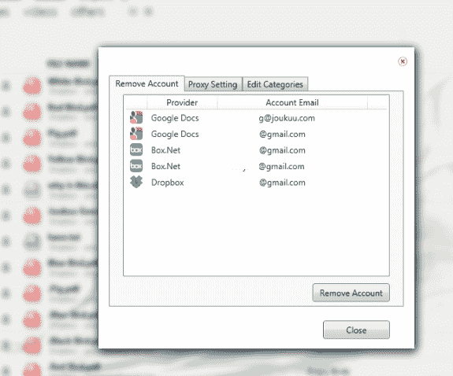
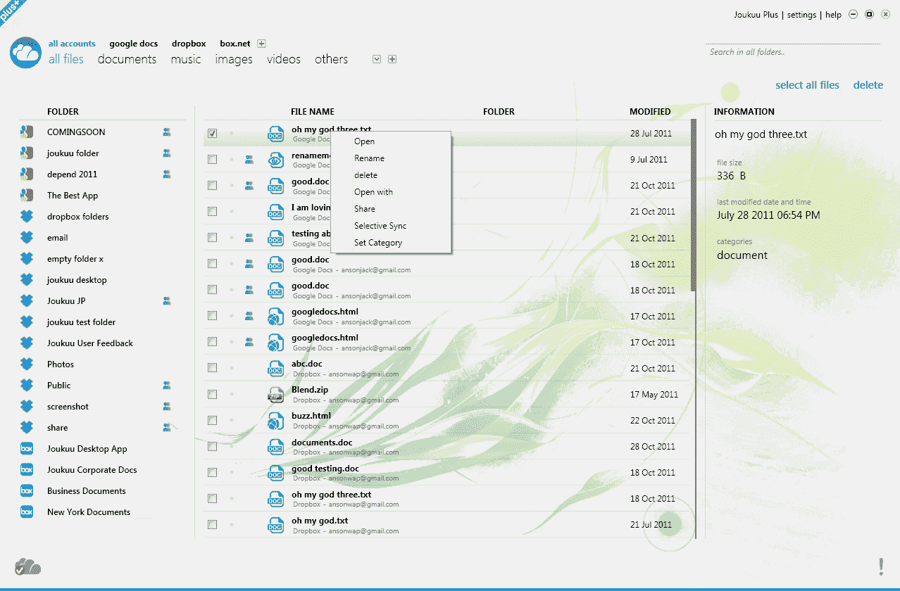
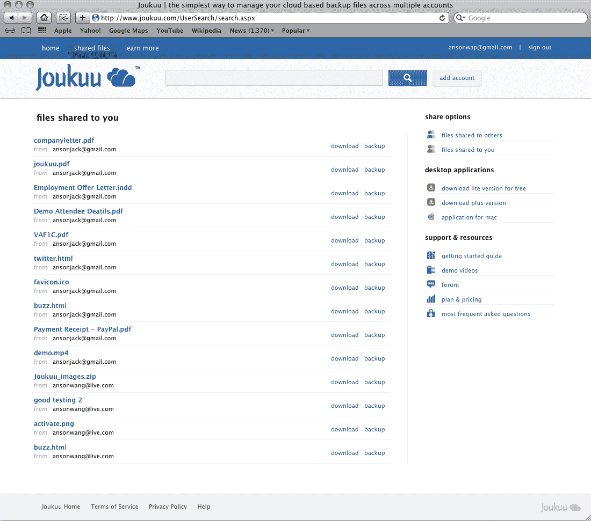
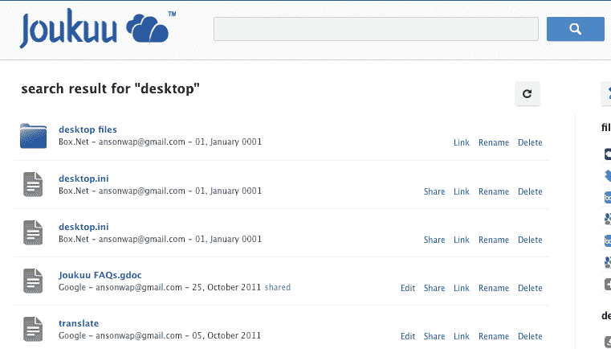

# Joukuu 让你可以管理谷歌文档、Dropbox 和 Box.net TechCrunch 上的文件

> 原文：<https://web.archive.org/web/http://techcrunch.com/2011/11/01/joukuu-lets-you-manage-files-across-google-docs-dropbox-and-box-net/>

# Joukuu 可以让你管理谷歌文档、Dropbox 和 Box.net 上的文件

你是否有分散在谷歌文档、Dropbox 和 Box.net 上的文件，并在寻找一种只使用一个平台来管理它们的方法？然后[Jou ku](https://web.archive.org/web/20230203094652/http://www.joukuu.com/)，一个支持上述服务的文件管理解决方案，可能会帮你搞定。这里的基本想法是通过一个被称为 [Joukuu Web](https://web.archive.org/web/20230203094652/http://www.joukuu.com/welcome/) 的集中平台，使跨多个云存储帐户跟踪、编辑和共享文件变得简单。(还有一个 Windows 专用的 [Joukuu 桌面应用](https://web.archive.org/web/20230203094652/http://www.joukuu.com/download/)。)

例如，你可以使用 Joukuu 管理你用于商业的 Google Docs 账户和你的私人 Dropbox 和/或 Box.net 账户中的文件，只需在浏览器中的一个窗口即可。(换句话说，如果你严格地只使用一家云服务提供商，Joukuu 不适合你。)

  添加账号后，Joukuu 会自动抓取并索引所有文件，让你通过干净的 UI 来处理。您可以直接通过 Joukuu Web 访问所有文件(和文件夹)，与不同云服务提供商的其他人共享选定的项目，或者添加/删除/复制/重命名任何文件和文件夹。所有修改都会同步回相关的云服务。

有趣的是，使用 Joukuu 可以跨帐户搜索特定的文件或文件夹，还可以跨不同的服务提供商与他人共享和协作文档。Joukuu 与 Google Docs 完全集成，这意味着您可以跨提供商与任何人共享或协作文件，而无需将任何文件上传到 Google Docs——一切都在您使用的备份帐户内完成。

文件共享和搜索:

另一个功能是，您可以为特定项目设置类别。例如，如果你想将分散在不同云服务账户中的图片集中起来，你可以创建一个“照片”类别，并将 Joukuu 上的所有项目拖放到该类别中。

然而，目前这只能在桌面应用程序上实现，Joukuu 提供了一个名为 Plus 的付费版本(价格:29.99 美元)和一个免费的精简版本。如果你是 Mac 用户(或者不想下载[客户端](https://web.archive.org/web/20230203094652/http://www.joukuu.com/download/)，我建议试试网页版(刚刚推出，一个账户免费，多个账户每年 40 美元/未来十天 50%折扣)。

点击[此处](https://web.archive.org/web/20230203094652/http://www.joukuu.com/pricing/)查看不同版本的功能和价格对比。

Joukuu 目前正在计划智能手机的应用程序，并将支持更多的服务(Sugarsync、Huddle、Skydrive 等。)以后。