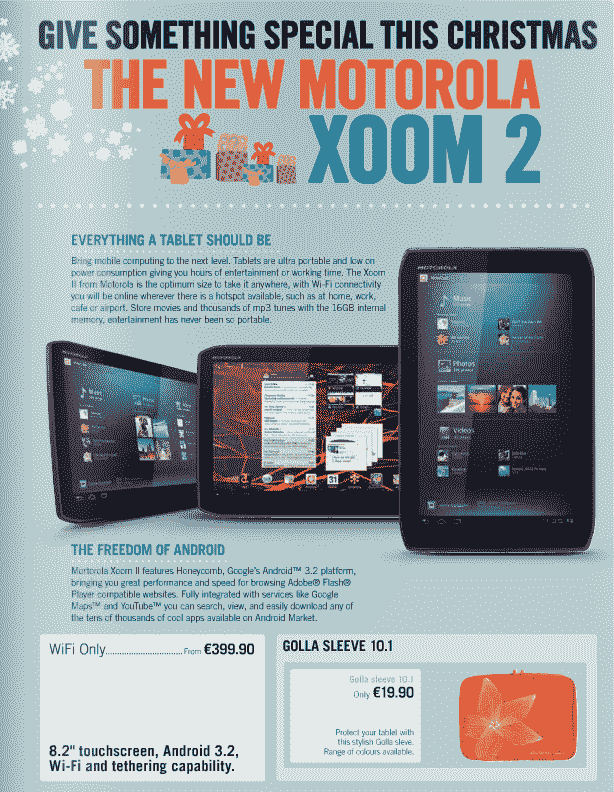

# 目录中发现的摩托罗拉 Xoom 2 应在圣诞节前发布 TechCrunch

> 原文：<https://web.archive.org/web/https://techcrunch.com/2011/11/01/motorolas-xoom-2-spied-in-catalog-should-launch-before-christmas/>

# 目录中的摩托罗拉 Xoom 2 将在圣诞节前发布

我们半期待看到 Xoom 2 在摩托罗拉的 Droid RAZR 发布会上正式亮相(特别是因为一些标签的照片在发布会之前泄露)，但根据最新的 Carphone Warehouse 买家指南，Xoom 2 应该会在假期前首次亮相。

我设法找到了问题页面的高分辨率照片(见下图)，它指出了一些有趣的细节。

这款 16GB 的纯 WiFi 机型预计将在今年晚些时候登陆爱尔兰，售价为€399 英镑(约合 545 美元)。它还运行 Android 3.2/Gingerbread，这让世界各地的冰淇淋三明治粉丝感到非常震惊。可悲的是，Carphone Warehouse 的撰稿人不喜欢技术上的东西，所以仍然没有确认 Xoom 2 在它的引擎盖下隐藏了什么。

广告的规格表还列出了 Xoom 2 的 8.2 英寸触摸屏，这带来了几个问题——这是传闻中内置红外发射器的媒体友好型机型吗？我们经常看到的 10.1 英寸型号在哪里？在这一点上，问题仍然多于答案，但是不久事情就会变得清晰起来。

对于它的价值，我得到的印象是，我们在这里看到的单位是更小的 Xoom 2 的最基本版本，代号为“弗莱明”。它缺少以前泄露的许多虚饰，如 LTE 无线电和更高容量的闪存芯片。如果没有别的，它给了我希望，一个钱包友好的 Xoom 2 可能很快就会在这些地方看到阳光。考虑到摩托罗拉正在以 379 美元的价格出售原版 Xoom 的[“家庭版”，450 美元的入门级 Xoom 2 也不是不可能，尤其是如果摩托罗拉只是想在假期移动硬件的话。](https://web.archive.org/web/20230203070623/https://techcrunch.com/2011/10/14/the-motorola-xoom-family-edition-hits-best-buy-for-379-comes-loaded-with-extra-apps/)

