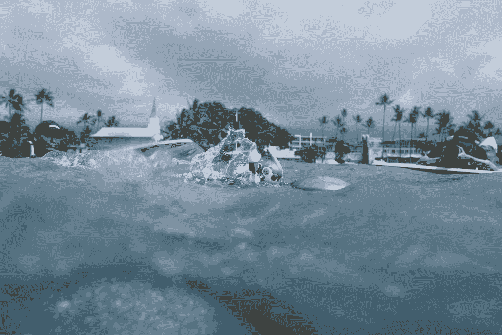
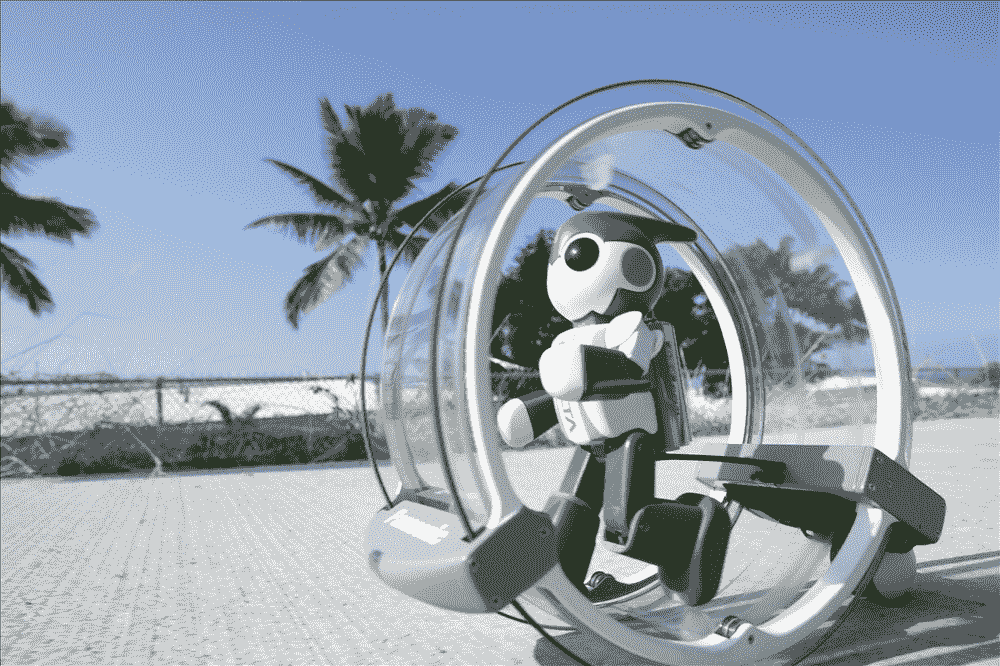
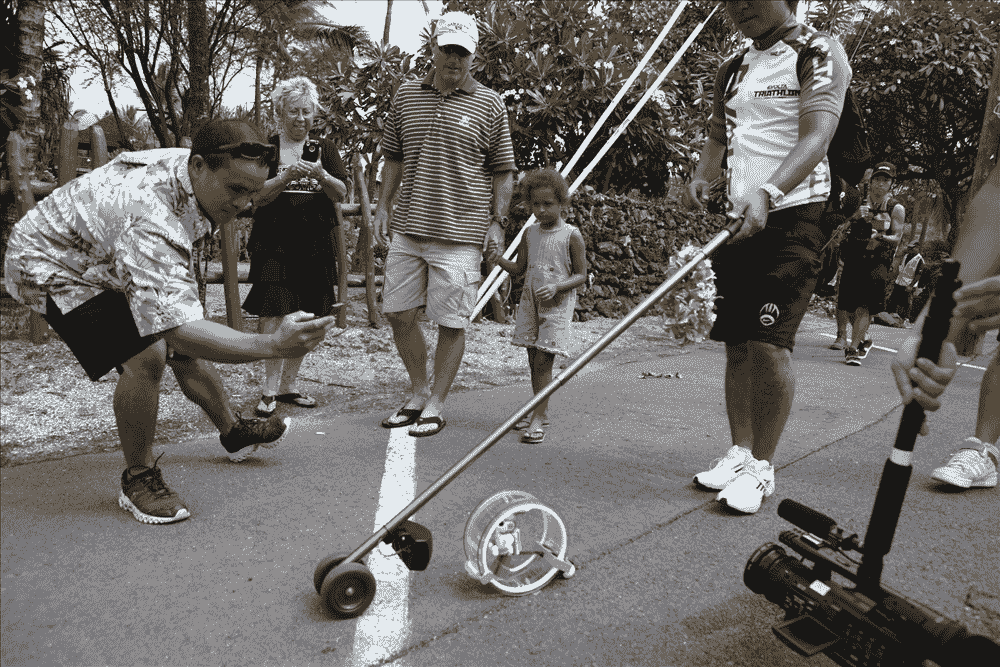

# 松下的 EVOLTA 迷你机器人完成了夏威夷铁人三项赛 TechCrunch

> 原文：<https://web.archive.org/web/https://techcrunch.com/2011/11/01/panasonics-evolta-mini-robot-finishes-hawaii-ironman-triathlon/>

# 松下的 EVOLTA 迷你机器人完成了夏威夷铁人三项赛

他在大峡谷爬上了 [500 米悬崖，在法国](https://web.archive.org/web/20221206161554/https://beta.techcrunch.com/2008/05/26/panasonic-robot-climbs-grand-canyon-cliff/)[勒芒 24 小时耐力赛](https://web.archive.org/web/20221206161554/https://beta.techcrunch.com/2009/08/07/panasonic-robot-runs-24km-on-two-aa-batteries-makes-it-into-guinness-book-of-world-records/)上表演了魔术，去年从东京到京都在[旅行了 500 公里](https://web.archive.org/web/20221206161554/https://beta.techcrunch.com/2010/11/22/panasonics-evolta-mini-robot-finishes-500km-journey-from-tokyo-to-kyoto/)，现在，他又在夏威夷完成了[铁人三项赛](https://web.archive.org/web/20221206161554/http://en.wikipedia.org/wiki/Ironman_Triathlon)。

我们[报道了](https://web.archive.org/web/20221206161554/https://beta.techcrunch.com/2011/09/15/video-panasonics-evolta-mini-robot-to-start-at-the-hawaii-ironman-triathalon/)松下计划让其 [EVOLTA](https://web.archive.org/web/20221206161554/https://beta.techcrunch.com/tag/evolta/) 电池供电的迷你机器人在 9 月份的 230 公里比赛中起跑，现在公司[宣布](https://web.archive.org/web/20221206161554/http://news.panasonic.net/archives/2011/1101_7235.html)这个小家伙在 10 月 30 日完成了比赛。

 

根据松下的说法，机器人(在三种不同的配置下)总共花了 166 小时 56 分钟游了 3.8 公里，骑了 180.2 公里，然后跑了 42.2 公里——由三块可充电的 EVOLTA 电池供电。