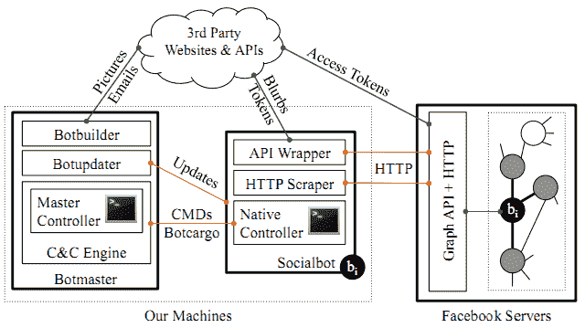

# 研究人员用机器人淹没脸书，收集 250GB 用户数据 TechCrunch

> 原文：<https://web.archive.org/web/https://techcrunch.com/2011/11/01/researchers-flood-facebook-with-bots-collect-250gb-of-user-data/>

在一项实验中，不列颠哥伦比亚大学的研究人员利用机器人渗透社交网络，窃取了成千上万用户的信息。这项实验揭示了脸书的人们和脸书一样多的信息。

在研究过程中，大约 250GB 的数据被盗，包括个人和可销售的信息，大约 3000 名用户成为目标。只有五分之一的特征被脸书免疫系统标记，这显然需要加强。

他们称之为“社交机器人”的假 UBC 账户是由几个简单的脚本创建的，这些脚本提交了必要的账户信息:姓名、图片和状态更新是从公开的网络上搜罗的，最终产生了 102 个相当可信的账户。组织这项工作的情报人员被形象地称为“干扰者”或“对手”。

接下来，他们向随机的人发送好友请求。不出所料，他们早些时候发现，越有魅力的人对不请自来的朋友请求会得到更好的回应，所以他们从热门与否的高端撤回了他们的个人资料照片。在最初的随机抽样中，只有 20%的人上钩，但后来，当他们加他们网络中的一个二级好友为好友时，成功率跃升至 60%。如果你想知道的话，这叫做“三元闭合原理”。每个机器人平均交 20 个左右的朋友，但有些人交了 80 或 90 个。

通过对帖子和好友请求进行限速以避免验证码，脸书的欺诈检测得以避免。脸书只检测到了 20 个特征，有趣的是，全部都是女性机器人变种。

考虑到帐户创建和传播过程的自动化是多么容易，人们不得不质疑脸书作为身份验证系统的有效性。自然地，它可以用来确定某一点上的同一性，但它肯定不是图灵测试。我们自己的评论部分显示，机器人和生成的帐户是丰富的。希望这个实验将刺激脸书改善这方面的安全，因为它的目的。也许这也会说服一些人在交友过程中更有选择性。

如果你想知道你是否无意中对实验有所贡献，从而对人类知识的总和有所贡献，请放心:

我们精心设计了我们的实验，以便通过遵循已知的实践来减少用户方面的任何潜在风险，并获得了我们大学的行为研究伦理委员会的批准。我们对所有收集的数据进行了严格加密和适当匿名化，在完成计划的数据分析后，我们已经完全删除了这些数据。

[您可以在此下载报告全文](https://web.archive.org/web/20230204223442/http://lersse-dl.ece.ubc.ca/record/264/files/ACSAC_2011.pdf?version=1)。虽然对于黑客和僵尸网络爱好者来说，它可能包含很少的新信息，但它却是有趣的读物。