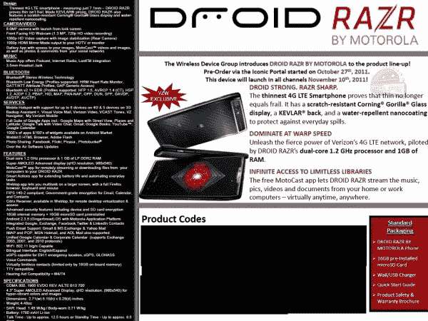

# 威瑞森文档指向 11 月 10 日 Droid RAZR TechCrunch 的发布

> 原文：<https://web.archive.org/web/https://techcrunch.com/2011/11/01/verizon-doc-points-to-november-10-launch-for-the-droid-razr/>

# 威瑞森博士指出机器人 RAZR 将于 11 月 10 日发布

还记得有一次摩托罗拉和威瑞森宣布了新的 [Droid RAZR](https://web.archive.org/web/20230205024122/https://techcrunch.com/2011/10/18/verizon-officially-unveils-the-motorola-droid-razr/) 吗，但是没有提供任何店内上市日期？像“11 月”这样模糊的日期只能在大众中度过这么长时间，这可能是威瑞森“传递”这份内部文件(全尺寸如下)给 [Droid-Life](https://web.archive.org/web/20230205024122/http://www.droid-life.com/2011/10/31/confirmed-droid-razr-launching-at-verizon-november-10/) 的原因，该文件详细说明了 11 月 10 日“所有渠道”的店内可用性。4G-LTE packin' RAZR 的合约价格为 299.99 美元。

在类似的新闻中，英国零售商 Clove 最初列出了 11 月 1 日的 RAZR 供货，但后来改为“从 11 月 7 日开始的一周”，报道 [Pocket-Lint](https://web.archive.org/web/20230205024122/http://www.pocket-lint.com/news/42824/motorola-razr-delayed-7-november) 。换句话说，它可能会在 10 号到达顾客手中。

作为补充，Droid RAZR 拥有 7.1 毫米的腰围，使其成为世界上最薄的智能手机，摩托罗拉说。它装有 1.2GHz 双核处理器，Android 2.3 姜饼(承诺对冰淇淋三明治进行更新)，并支持威瑞森的 4G LTE 网络。你会发现背面有一个 800 万像素的摄像头，能够以 1080p 拍摄视频，还有一个 130 万像素的前置摄像头，用于视频聊天。除了 4.3 英寸 qHD Super AMOLED 960×540 显示屏，这款手机还在背面配备了凯夫拉尔纤维外壳，以经受住“后口袋测试”

