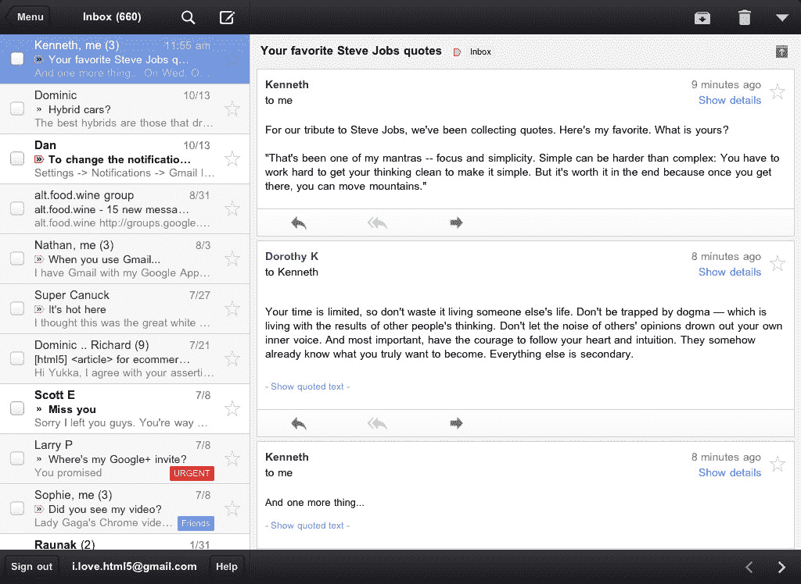

# 谷歌推出适用于 iPhone、iPad 和 iPod Touch 的原生 Gmail 应用程序，立即面临抵制 TechCrunch

> 原文：<https://web.archive.org/web/http://techcrunch.com/2011/11/02/google-launches-native-gmail-app-for-iphone-ipad-and-ipod-touch/>

# 谷歌推出适用于 iPhone、iPad 和 iPod Touch 的原生 Gmail 应用，立即遭到强烈反对

谷歌今天发布了一款新的适用于 iPhone、iPad 和 iPod Touch 的原生 Gmail 应用程序，这款应用程序现在可以在 T2 的 iTunes 应用商店买到。正如 TechCrunch 作家 MG Siegler 最近在他的[个人博客](https://web.archive.org/web/20230203112337/http://parislemon.com/post/12181169812/incoming-a-native-gmail-iphone-app-finally)上透露的那样，该应用最重要的功能之一是其推送通知的能力。该应用程序还将包括搜索、自动完成、附件支持、优先收件箱访问、标签和其他标准电子邮件功能，如存档、删除和报告垃圾邮件。

对许多人来说，新的应用程序应该是 Gmail 现有的基于网络的应用程序的一个改进，因为它支持推送通知——这是 iPhone 本身在不通过 Exchange 工作的情况下无法为 Gmail 做的。仅此一点就可能成为改变的理由。

***更新**:唉！根据早期的评论([和大量的](https://web.archive.org/web/20230203112337/http://twitter.com/#!/search/gmail%20app%20sucks) [Twitter 投诉](https://web.archive.org/web/20230203112337/http://twitter.com/#!/search/gmail%20app%20fail))，推送通知功能被破坏，应用程序不支持多个帐户。来吧谷歌，让它在一起。*

http://twitter.com/#!/Scobleizer/status/131773218825580544

http://twitter.com/#!/Paris lemon/status/131773672687009793

在新的应用程序中也可以访问优先收件箱，因为你可以向右滑动，在一个看起来受(复制自？)脸书最近的 [iPhone/iPad 应用](https://web.archive.org/web/20230203112337/https://techcrunch.com/2011/10/10/facebooks-ipad-app-is-finally-here-yes-for-real-this-time/)更新。

在 iPad 上，Gmail 的应用程序包括一个分格视图，就像苹果自己的邮件应用程序一样，但 Gmail 有自己的线程对话:

通过谷歌官方[博客文章](https://web.archive.org/web/20230203112337/http://googlemobile.blogspot.com/2011/11/introducing-gmail-app-for-iphone-ipad.html)，新应用的完整功能列表包括以下内容:

*   *通过推送通知和声音获得新消息提醒*
*   *通过搜索整个收件箱，在几秒钟内找到一封电子邮件*
*   *从您的 Gmail 联系人中自动填写电子邮件地址，或者从您手机的地址簿中选择*
*   *使用合成视图中的新附件按钮点击上传照片*
*   *在 iPad 上，浏览收件箱，同时使用拆分视图阅读邮件*
*   *优先关注收件箱中的重要邮件*
*   *用线索对话快速浏览无数封相同主题的电子邮件*
*   *通过归档、标记、标记、删除和报告垃圾邮件来组织您的邮件*
*   *如果你渴望收到新邮件，拉下收件箱快速刷新*
*   *向右滑动查看标签，无需离开收件箱*
*   只需滑动手指，就能快速浏览数十封电子邮件