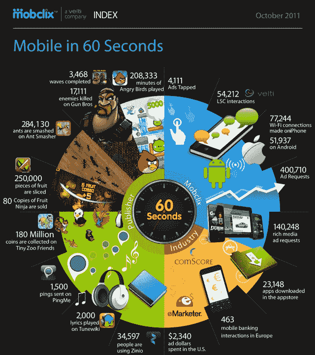

# 信息图:60 秒内的移动世界 TechCrunch

> 原文：<https://web.archive.org/web/http://techcrunch.com/2011/11/02/infographic-the-mobile-world-in-60-seconds/>

# 信息图:60 秒后的移动世界

说移动领域发展迅速是相当温和的说法，但移动广告交易所 Mobclix 的一张信息图旨在强调每 60 秒发生的事情。

如果你好奇的话，在我写下第一句话的时间里，超过 23，000 个 iOS 应用程序从苹果的应用程序商店下载。

Mobclix 使用直接来自应用程序发行商、行业来源的数据和一点老式的算法来获得你在下面看到的 60 秒统计数据。当然，考虑到 Mobclix 的背景，其中也必须有一些广告相关的仿真陈述。移动广告客户会很高兴知道(如果他们还不知道的话)每分钟大约有 4111 个广告被点击，尽管这几乎会让你怀疑在同样的 60 秒时间内有多少广告被忽略。

我不知道你们是怎么想的，但是我会睡得更好，因为我知道在我入睡和醒来之间，人们会在小小的动物园朋友中收集到 648 亿个硬币。

【T2