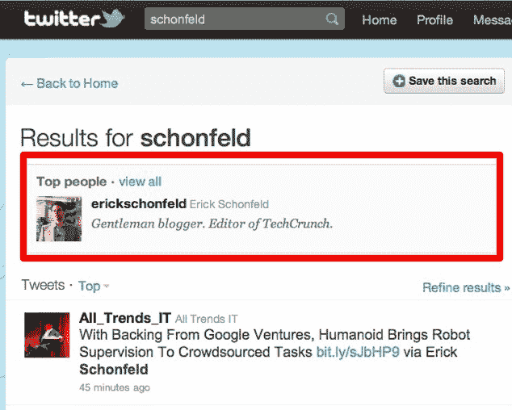

# Twitter 测试搜索结果顶部的“热门新闻”和“热门人物”

> 原文：<https://web.archive.org/web/http://techcrunch.com/2011/11/02/twitter-top-news-people-search-results/>

# Twitter 测试搜索结果顶部的“热门新闻”和“热门人物”

在一些用户的测试中，Twitter 在其实时搜索结果的顶部添加了“头条新闻”和“热门人物”结果。当你搜索一个热门故事，比如“ [gmail](https://web.archive.org/web/20230203065120/https://twitter.com/#!/search/gmail) ”(今天推出了一个[漏洞百出的 iPhone 应用](https://web.archive.org/web/20230203065120/https://techcrunch.com/2011/11/02/new-gmail-app-for-iphone-is-unusable-shows-errors-on-launch/))甚至“[人形](https://web.archive.org/web/20230203065120/https://twitter.com/#!/search/humanoid)”(我刚刚[写了一篇关于](https://web.archive.org/web/20230203065120/https://techcrunch.com/2011/11/02/humanoid-google-ventures/)的新创业公司)，你会看到一个突出显示的方框结果，其中有一个链接，指向一个热门新闻故事，以及那篇文章或博客文章的缩略图。类似地，搜索任何在 Twitter 上出名的人，都会出现一个“热门人物”的结果，上面有他们的 Twitter 个人资料图片和他们的信息流链接。**更新**:搜索“ [twitter](https://web.archive.org/web/20230203065120/https://twitter.com/#!/search/twitter) ”马上就会出现这篇文章。

同样，这是一个只有一小部分用户可以看到的实验。今天早些时候我第一次注意到这一点，我以为这是一个付费搜索广告。但它实际上是一种帮助用户发现最受欢迎的内容和人的方式。据推测，热门新闻是基于转发和 Twitter 为新闻来源保留的某种白名单。虽然如果你重复搜索，头条新闻有时会转到另一个来源。

无论哪种方式，这都是一个聪明的举动，因为出版商将会看到更多来自 Twitter 的流量，如果他们设法让他们的故事在 Twitter 搜索上排名靠前的话。Twitter 正在用新闻结果测试这一点，这一事实表明它是多么专注于成为所有媒体的消息传递总线。

除了新闻，还有一种商业模式:对排名靠前的位置收费，就像谷歌对付费搜索收费一样。我希望我们永远不要把头条新闻视为付费产品(这将导致最绝望的新闻网站和博客的最糟糕的故事付费登上搜索结果的顶端)，但不难想象带有商业意图的搜索结果，如“鞋子”或“相机”。

