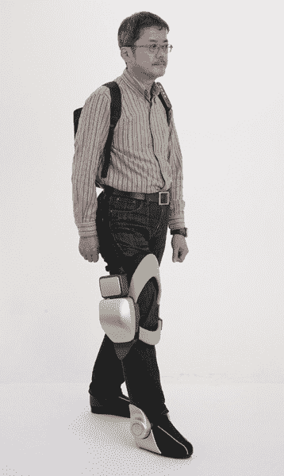
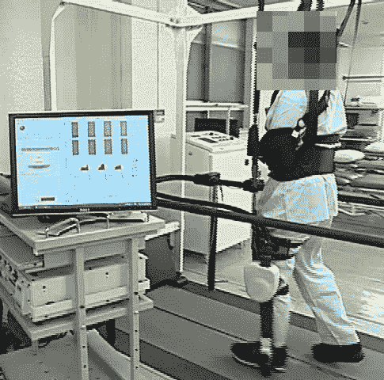
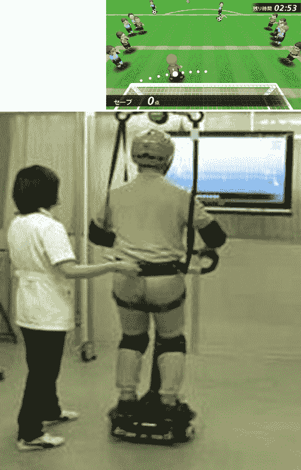
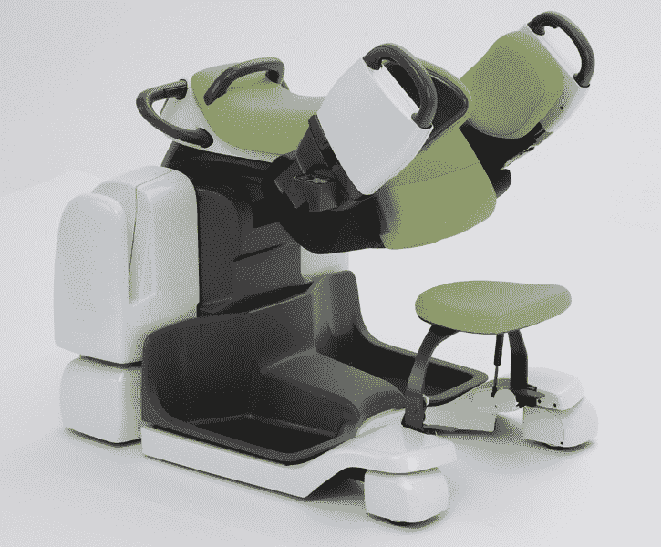

# 视频:丰田展示四款医疗和护理机器人 TechCrunch

> 原文：<https://web.archive.org/web/http://techcrunch.com/2011/11/02/video-toyota-shows-four-healthcare-and-nursing-robots/>

# 视频:丰田展示四款医疗和护理机器人

本田并不是唯一一家活跃在机器人领域的日本汽车制造商。)，丰田在这一领域也活跃了相当一段时间。大 T [昨天展示了总共四个机器人，都是针对医疗保健和护理市场的。日本最大的汽车公司关注这些领域并不奇怪，因为日本是世界上老龄化最严重的国家(23%的人口年龄在 65 岁以上)。](https://web.archive.org/web/20230203091200/http://www2.toyota.co.jp/en/news/11/11/1101.html)

以下是丰田在东京新闻发布会上展示的机器人:

独立行走辅助(帮助瘫痪者行走)
 
行走训练辅助(支持行走障碍者恢复自然行走)
 
平衡训练辅助(训练站立时难以保持平衡的人)

病人转移辅助(四个机器人中最先进和最独特的，帮助护理人员抬起和移动病人)

丰田考虑在“2013 年后”将这些机器人商业化。

这段由 [Diginfo TV](https://web.archive.org/web/20230203091200/http://www.diginfo.tv/2011/11/02/11-0239-r-en.php) 在外景拍摄的视频，提供了更多见解(英文):
【YouTube = http://www . YouTube . com/watch？v = kGegMjb3QUY&w = 560&h = 315】