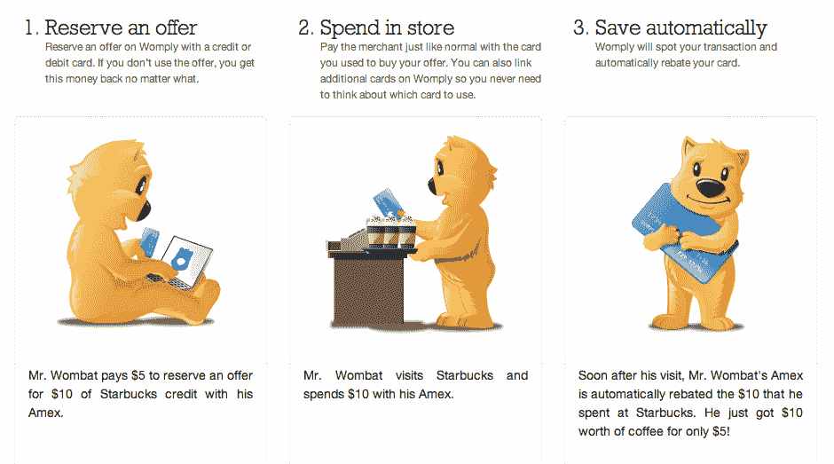
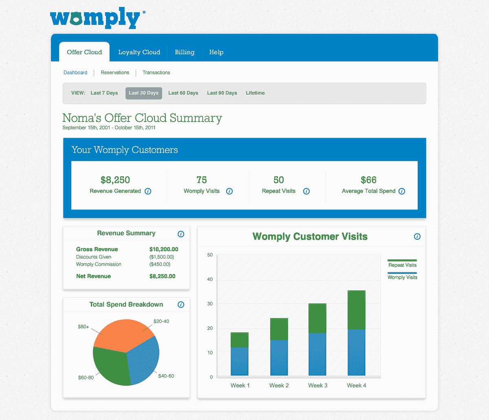

# Womply 的新交易创业公司将本地优惠加载到您的信用卡上 TechCrunch

> 原文：<https://web.archive.org/web/http://techcrunch.com/2011/11/02/womplys-new-deals-startup-loads-local-offers-onto-your-credit-cards/>

[Womply 的“e forless Offers”](https://web.archive.org/web/20230205021035/https://womply.com/)是一个新的优惠平台，将当地商户的折扣与所有主要的信用卡和借记卡联系起来，包括 Visa、MasterCard、American Express 和 Discover。该服务目前在华盛顿特区上线，计划在明年 1 月初推广到另外五个市场，给消费者的感觉就像是一个日常交易网站，但它的工作方式就像是为当地商家做定向广告。

Womply 与 Groupon 等公司的主要区别在于，它们的服务是针对消费者的个性化服务，并且面向特定的受众。他们不要求一定数量的购买者才能给“小费”，也没有优惠券要打印。

这家公司上周刚刚在华盛顿特区成立，创始人是 LivingSocial [的前总经理兼销售主管 Brandt Squires](https://web.archive.org/web/20230205021035/http://www.linkedin.com/pub/brandt-squires/6/45a/482) ，Brandt Squires 的旧初创公司[buyyourfrieddrink](https://web.archive.org/web/20230205021035/http://www.crunchbase.com/company/buyyourfriendadrink-com)于 2009 年被 LivingSocial 收购，还有 Toby Scammell ( [是的，他](https://web.archive.org/web/20230205021035/http://dealbook.nytimes.com/2011/08/17/insider-trading-defendant-in-disney-case-fights-back/))，但我们不要因为一个 24 岁的年轻人的错误而让 Womply 完蛋，好吗？)

Womply 已经从 500 Startups 和 Deebek Ventures，LLC 的 Dave McClure 那里筹集了近 100 万美元。

Womply 轻松优惠的运作方式如下:

在注册时，通常通过脸书登录，Womply 可以利用客户的脸书个人资料数据来初步定位和显示附近的最佳报价。为了获得这笔交易，客户将使用信用卡或借记卡进行购买。后来，当他们拜访商家时，他们为所提供的商品或服务支付全价。Womply 与银行和其他金融合作伙伴有合作关系，可以发现交易，然后贷记差额。信用在两天内出现。

虽然 Womply 意味着客户要预先花更多的钱，但这项服务对消费者和商家都有几个好处。消费者不必记得打印优惠券或随身携带——他们可以像往常一样使用信用卡或借记卡来接收交易。此外，由于交易需要额外的前期投资，消费者不太可能冲动购买交易，而更可能只购买他们计划使用的交易。定位和个性化也有助于减少日常交易产生的噪音，这也是谷歌现在通过其谷歌优惠产品走的同一条路。

对于[商家](https://web.archive.org/web/20230205021035/https://www.womply.com/merchants)，Womply 发现交易的能力意味着它知道有多少优惠是 100%有把握兑现的。此外，由于 Womply 的个性化功能，商家并不将 Womply 视为“日常交易”服务，而是将其视为更类似于定向广告的服务。

今后，Womply 将能够利用其交易发现能力，进一步完善它向消费者推销的交易，并奖励他们对特定商家的忠诚度。这可能是其下一个尚未披露的第二个产品的基础，该产品将在几周内推出。

华盛顿地区的居民现在可以在这里注册 Womply[。](https://web.archive.org/web/20230205021035/https://womply.com/)