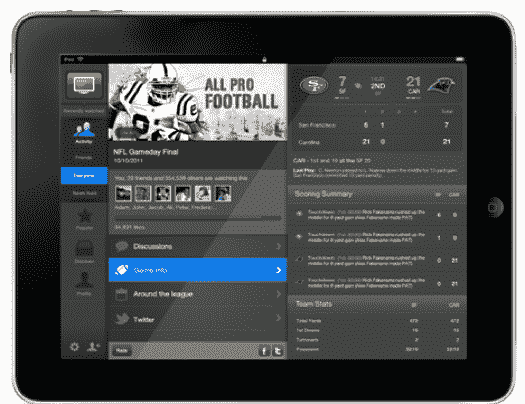

# 雅虎将智能社交电视应用 IntoNow 引入 iPad 添加内容源等 TechCrunch

> 原文：<https://web.archive.org/web/http://techcrunch.com/2011/11/02/yahoo-brings-intelligent-social-tv-app-intonow-to-the-ipad-adds-content-feeds-and-more/>

# 雅虎将智能社交电视应用 IntoNow 引入 iPad 添加内容源等

社交电视应用 [IntoNow，](https://web.archive.org/web/20230203063934/http://www.intonow.com/ci)于今年早些时候被雅虎[以 2000 万至 3000 万美元收购](https://web.archive.org/web/20230203063934/https://techcrunch.com/2011/04/25/yahoo-intonow/)，今天随着原生应用的推出，它将走向 iPad。

如果你不熟悉 IntoNow，这项服务 [IntoNow](https://web.archive.org/web/20230203063934/http://www.intonow.com/) ，一项新服务[允许你告诉你的朋友](https://web.archive.org/web/20230203063934/https://techcrunch.com/2011/01/31/intonow/)你正在实时观看什么电视节目和电影。但与其他媒体“签到”服务不同，你只需点击一个按钮，让你的手机收听你正在观看的内容。与其他众多的社交签到应用相比，正是这种音频追踪技术让它成为雅虎极具吸引力的一笔交易。

这家初创公司的 iPhone 和 Android 应用程序仅在 1 月份推出，就已经获得了 160 万次下载，而且参与度也很高。

因为 iPad 是观看电视和电影的理想伴侣，将 IntoNow 引入设备具有巨大的潜力。事实上，IntoNow 创始人亚当·卡汉告诉我们，研究表明，当消费者看电视时，使用平板设备最受欢迎。根据尼尔森的数据，超过 70%的平板电脑用户和 68%的智能手机用户表示，他们在看电视时使用他们的设备——大部分时间都在查找他们正在观看的节目内容或新闻。

IntoNow 的新 iPad 应用程序可能是迄今为止功能最丰富的产品。如果用户“登录”像 ABC News 这样的节目，谈论的主题是政治，IntoNow feed 将开始填充来自许多不同来源的最新政治新闻，为用户提供上下文信息。此外，当主题切换到完全不同的内容时，例如名人八卦，应用程序会“倾听”变化，并开始自动在应用程序中填充关于该名人的新闻、关于该人的推文、提供视频等。

该应用程序也非常适合观看体育比赛。如果你登录一场特定的足球比赛，你不仅会看到关于这场比赛的新闻和推文，还会弹出雅虎的统计跟踪器，这样你就可以立即看到比分，QB 投了多少码，谁触地得分了，等等。

显然，这是社交电视领域的一个重大举措。用户除了在节目中签到之外，实际上不需要做太多事情，应用程序会完成所有的工作，推动内容的管理。

