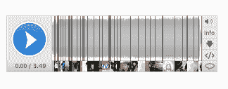
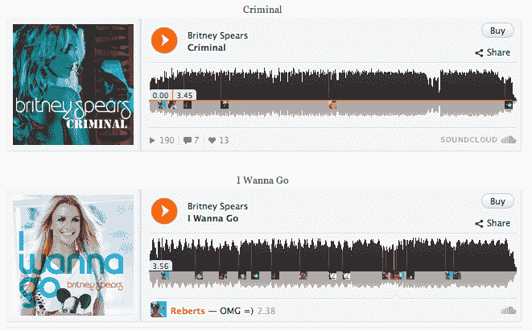

# SoundCloud 首次推出其新的 HTML5 小工具，看起来比旧的好得多 TechCrunch

> 原文：<https://web.archive.org/web/http://techcrunch.com/2011/11/03/soundcloud-debuts-its-new-html5-widget-looks-so-much-better-than-old-one/>

# SoundCloud 首次推出新的 HTML5 小工具，看起来比旧的好多了

今天早上，流行的音频平台 [SoundCloud](https://web.archive.org/web/20230205044528/http://soundcloud.com/) 首次亮相其全新的 HTML5 小工具，现在将与[当前的 Flash 小工具](https://web.archive.org/web/20230205044528/http://soundcloud.com/pages/widgets)一起以测试版格式提供，但最终将取代它。这个完全重新设计的小工具允许 SoundCloud 用户将他们的录音和上传嵌入到他们的博客或网站上，查看关于声音、其创作者、喜欢、评论和播放的信息，并轻松地将声音分享到脸书、Twitter 和 Google+等社交网络。

而且，它看起来好多了。

SoundCloud 表示，新的小工具经过了重新设计，以鼓励围绕声音本身以及与听众评论的更多互动。应 SoundCloud 用户的要求，定时评论现在在这个版本的小工具上更有用了。以前，它们会以对话气泡的形式出现在轨道上。在新的小工具中，它们以更易读的格式出现在曲目下方。

这个第一个公开测试版包括上面提到的社交分享选项，但后续版本将包括更多的社交元素。当你点击右上角的分享按钮时，脸书(喜欢)、Twitter 和 Google+会显示出来，但下面会显示 Tumblr、脸书(分享)、Reddit、StumbleUpon 和 email 的较小图标。还提供了链接和嵌入代码。

该公司表示，因为这个小工具现在建立在 HTML5 技术的基础上，SoundCloud 将能够以更快的速度添加更多功能。在未来的某个时候，这个新的小部件将完全取代 Flash 版本。

HTML5 小工具已经出现在一些索尼音乐艺术家的页面上，包括[布兰妮](https://web.archive.org/web/20230205044528/http://www.britney.com/us/news/britney-soundcloud)和[大时代 Rush](https://web.archive.org/web/20230205044528/http://www.btrband.com/us/news/music-sounds-better-u) ，以及 [Wattpad](https://web.archive.org/web/20230205044528/http://www.crunchbase.com/company/wattpad) 的 [Tumblr](https://web.archive.org/web/20230205044528/http://blog.wattpad.com/) ，这是一个面向读者和作家的社交网络。

下面是旧的 Flash 插件(上)和新的插件(下)的截图(不是嵌入的)。

