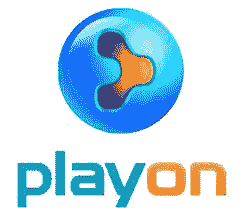
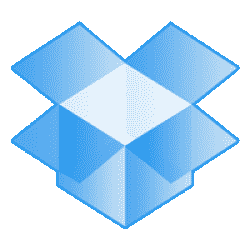

# 四个几乎修复了谷歌电视 2.0 的权宜应用(和一个额外的应用)

> 原文：<https://web.archive.org/web/http://techcrunch.com/2011/11/04/four-stopgap-apps-that-almost-fix-google-tv-2-0-and-one-bonus-app/>

谷歌电视 2.0 在本周早些时候推出了，最终将 Android Market 带到了客厅平台。但是谷歌电视[仍然不完美。不管是好是坏，产品对应用的依赖允许第三方开发者站出来填补空白。](https://web.archive.org/web/20230203152424/https://techcrunch.com/2011/11/03/google-tv-v2-review-its-getting-closer/)

希望有一天，谷歌电视将拥有一个丰富的应用生态系统，其中充满了有趣和精彩的应用。那不是今天。大多数启动应用都是随机的 Android 应用，从 LauncherPro 到 Twitter。侧装是允许的，但这是偶然的。一些应用程序有效，大多数无效。休息之后的五个应用程序主要补充了谷歌电视的功能，尽管其中一个是因为一个有趣的饮酒游戏而被包括在内。

** 丛**

谷歌电视缺少一个可靠的本地网络媒体播放器。它本身支持 DLNA 服务器，但我不喜欢 DLNA 服务器。它们是资源密集型的，需要即时转码，并且通常只支持有限的文件类型。Google TV 需要具备作为中小型企业客户端浏览本地网络和远程播放内容的能力。这是大多数本地网络流媒体多年来一直在做的事情。但谷歌电视不是。

Plex 处理本地媒体的方式与 DLNA 服务器类似。仍然需要一个服务器端应用程序，但它支持所有主要的文件类型，包括那些包装在 MKV 容器中的文件。Plex 很有可能可以播放您的所有文件。该应用程序还具有时髦的音乐和照片模式。不过，Plex 的一个主要缺点是服务器应用程序。它需要 Core 2 Duo 或更好的 CPU，这意味着大多数较旧的文件服务器或网络连接存储设备都被排除在外。

尽管如此，Plex 仍然是一个很棒的应用程序，并大大增加了谷歌电视的功能。它看起来很棒，运行流畅，只要你的文件存储在兼容的设备上，花 5 美元买这个应用程序是明智的。它不仅像冠军一样播放本地媒体，还提供对 Spotify、Viemo 和大量其他资源的访问。我怎么推荐 Plex 都不为过，真的。

** 季后赛**

每当我说 Hulu 和其他网站在谷歌电视上被屏蔽了，评论者总是把我指向 PlayOn。在很大程度上，他们是对的；PlayOn 确实提供所有这些服务。然而，我不是该应用程序的粉丝。它建立在一个松散的 DLNA 服务器上，操作丑陋，更糟糕的是，播放费用昂贵。这款服务器应用的月费为 5 美元，年费为 40 美元，或者一次性支付 80 美元。

PlayOn 通过后门提供数量可观的内容。该应用程序几乎可以播放所有主流流媒体，包括网飞、YouTube、Hulu、ESPN、CBS 等等。这是使用 DLNA 服务器完成的。用户在服务器应用程序上输入用户名和密码，然后通过本地网络向 DLNA 客户端或网络浏览器提供视频流，有效地绕过了谷歌电视上的任何屏蔽。它可以工作，但并不优雅。幸运的是，有一个免费试用，所以你可以尝试一下，而不用交出你的信用卡。

**[文件专家](https://web.archive.org/web/20230203152424/https://techcrunch.com/wp-content/uploads/2011/11/file_expert-200x200.png)**

如果你想深入研究谷歌电视，你需要一个文件管理器。我偶然发现了文件专家，但它似乎工作得很好。它支持本地网络浏览，因此您可以将 apk 等放在本地网络共享中，以便于安装。该应用程序甚至允许轻松卸载应用程序。有很多文件管理器，但是这个是免费的，看起来做得很好。

目前，将应用程序下载到谷歌电视是一件愚蠢的事情。大多数在谷歌电视的 Android Market force 中找不到的应用程序在启动后会立即关闭。但我的小小警告可能阻止不了你。你要自己试一下，看看愤怒的小鸟还不行。

** Dropbox**

或者，可以通过 Dropbox 进行侧装。安装有点不稳定，因为该应用程序在安装过程中抛出了几个错误，但它最终为我加载。随着越来越多的用户试图利用谷歌电视，Dropbox 是一种访问远程文件和安装应用程序的简单方式。只需将 apk 放入其中一个共享文件夹，然后在谷歌电视上调出即可。简单。

然而，如果谷歌电视上没有安装合适的应用程序，就不要指望阅读 PDF 文件或 Word 文档。如果不安装额外的软件，即使是 MP3 也不能工作。

**美国在线高清**

AOL 实际上有一个坚实的视频内容组合。 [Translogic](https://web.archive.org/web/20230203152424/http://translogic.aolautos.com/) ？太棒了。但是 TCTV 的由 Erick 和 John 主演的[不成功便成仁](https://web.archive.org/web/20230203152424/http://www.techcrunch.tv/show/fly-or-die)是最好的。它是如此之好，它有一个官方的饮酒游戏，谷歌电视是一个完美的设备。

这是:

*   如果埃里克打断了约翰，就喝一杯
*   如果埃里克和约翰都给产品一只苍蝇，就喝吧
*   如果 Erick 和 John 都拒绝该产品，请喝一杯
*   如果约翰穿了一件菱形花纹的毛衣，就喝一杯
*   如果埃里克不停地说两分钟，就把你的酒喝完

* * *

我错过什么了吗？请在下面的评论中留下你的建议。

[图片通过[连线](https://web.archive.org/web/20230203152424/http://www.wired.com/gadgetlab/2010/03/google-tv-google-sony-intel-team-up-to-make-television/)