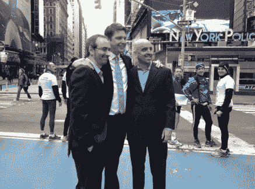

# Groupon 首次公开募股的股票在第一次交易中上涨了 40%，以 28 美元的价格上市，市值达到 178 亿美元

> 原文：<https://web.archive.org/web/https://techcrunch.com/2011/11/04/groupon-ipo-shares-pop-40-on-first-trade-debuts-at-17-8b-market-cap/>

# Groupon 首次公开募股的股票在第一次交易中上涨了 40%，以 28 美元的价格上市，市值达到 178 亿美元

在经历了一些时间上的戏剧性事件后，团购网站 Groupon 终于在今天早上开始在纳斯达克交易，这是自谷歌以来最受期待和最大的互联网公司 IPO。该公司股票代码为$GRPN，昨晚的发行价为 20 美元，但开盘价为 28 美元，涨幅为 40%。

和 LinkedIn 一样，Groupon 的流通股也很少，只有 3500 万股，约占其 6.373 亿股流通股的 5.5%。第一笔交易会将其市值锁定在 178 亿英镑，融资 9.8 亿英镑。

Groupon 于 6 月初[提交了 S-1 申请](https://web.archive.org/web/20230406082700/https://techcrunch.com/2011/06/02/groupon-files-for-ipo/)，此后，这家成立三年的公司经历了一段坎坷的 IPO 之路，负面新闻报道和大幅降价的报道困扰着这家公司。

由于报告中的错误，其 2010 年 S-1 的收入从 7.13 亿美元调整到 3.13 亿美元。由于同样的调整，其 2011 年上半年的总收入从 15 亿美元降至 6.88 亿美元。去年年底，该公司拒绝了谷歌 60 亿美元的收购要约。

该公司去年亏损 4.2 亿美元，2011 年第一季度亏损 1.171 亿美元，主要原因是扩张和营销成本——潜在投资者和纸上谈兵的 Twitter 专家不会忽视这一事实，他们中的许多人[无法抗拒](https://web.archive.org/web/20230406082700/https://twitter.com/#!/search/%24GRPN)今天早上的“泡沫/天启的迹象”谈话或蹩脚的交易笑话。

至少可以说，观察股票今天的表现会很有趣。

**更新:**看起来[pop 在交易的前 20 分钟已经下跌](https://web.archive.org/web/20230406082700/http://www.google.com/search?aq=f&gcx=c&ix=c2&sourceid=chrome&ie=UTF-8&q=grpn)，现在徘徊在 26 美元左右。待[调好](https://web.archive.org/web/20230406082700/http://www.google.com/search?aq=f&gcx=c&ix=c2&sourceid=chrome&ie=UTF-8&q=grpn)！

*Pic via[Julie _ Mo](https://web.archive.org/web/20230406082700/https://twitter.com/#!/julie_mo/status/132449263769747456/photo/1)/[Emily Chang](https://web.archive.org/web/20230406082700/https://twitter.com/#!/emilychangtv/status/132459425255526401/photo/1)*