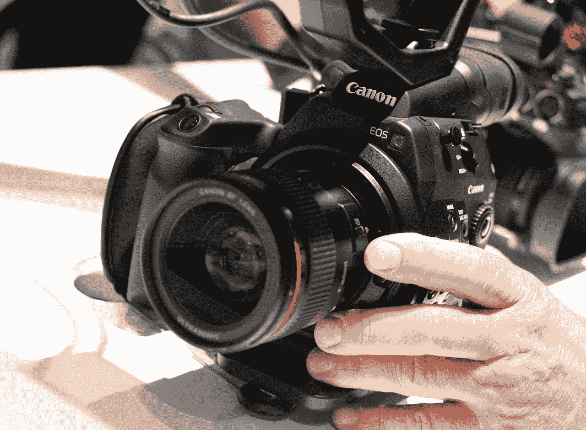
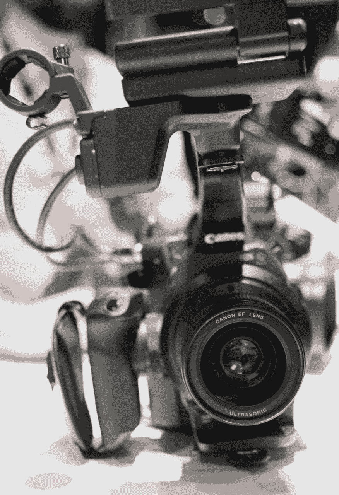
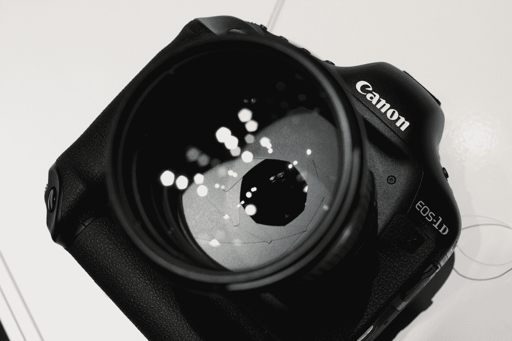
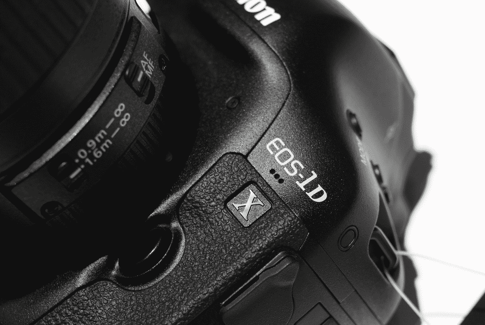

# 更多信息和第一印象:佳能全新 C300 Pro 影院摄像机 TechCrunch

> 原文：<https://web.archive.org/web/http://techcrunch.com/2011/11/04/more-info-and-first-impressions-canons-new-c300-pro-cinema-camera/>

影院技术并不是 TechCrunch 的主要关注点，但对于佳能来说，这是有意义的，特别是当影院技术代表着与消费设备的主要重叠时。昨晚推出的电影 EOS 系列正是如此，我刚刚有机会得到新的 [C300](https://web.archive.org/web/20230204113712/https://techcrunch.com/2011/11/03/canon-goes-all-in-on-eos-with-c300-digital-cinema-system-new-dslr/) 数字电影摄像机(以及与新的 [1D-X](https://web.archive.org/web/20230204113712/https://techcrunch.com/2011/10/17/canons-new-professional-1d-x-goes-full-frame-improves-video/) 的一点优质时间)。我也向佳能研发部门的查克·韦斯特福尔提了几个问题。

这款新相机最明显的一点就是它的小巧和易操作性。我找到了最简单的设置，如上图所示，也是购买 C300 的默认包装(除了镜头)。它很轻，很平衡，控制感觉很方便拇指或手动操作。

虽然我怀疑任何 AAA 功能将被拍摄在这个微设置，它确实证明了如何最小的最小可行的相机单位。实际上，我很惊讶它配有内置 EVF，这不是特别高的分辨率(150 万点，大约 840×600 像素左右)，对许多电影制作人来说是多余的。而且它确实增加了可用的选择。

我和 Chuck Westfall 谈论了相机，他说他们采访了很多工作人员和摄影师，他们喜欢 DSLRs 的小尺寸和易操作性，但不喜欢缺少端口和图像质量问题。C300 是对这些问题的直接回应。

 镜头的设计也考虑到了动态摄影。360 度对焦环和无级光圈(感觉像黄油一样光滑，在某些情况下真的很好)是面向电影的，他们甚至给元素涂上了不同的涂层，以降低对比度，让电影制作人做更多事情。不使用传统光圈数的 iris 将如何记录数据或与相机通信尚不清楚，佳能代表无法回答我的问题，理由是大多数设备都是预生产的。但是他们确认光圈控制是完全手动的。

我问的是选择配 1080p [RED 昨晚的声明](https://web.archive.org/web/20230204113712/https://techcrunch.com/2011/11/03/reds-scarlet-gets-official-4k-for-under-10k/)将 4K 唱片的价格定得非常合理，我想知道佳能是否感到了威胁。Westfall 解释说，对于 C 系列中的“初始产品”,他们希望它能适应尽可能多的现有工作流程。虽然 4K 显然是佳能的未来(正如 4K·DSLR 概念的宣布所证明的那样，他们想推出一些东西，可以插入到许多以 1080p 拍摄的作品中。这是一个很大的数字——你可能会惊讶地听到有多少人仍在拍摄磁带或电影。

至于 RED 的产品以及它如何与 C 系列相关或竞争，Westfall 外交地说“市场将告诉我们他们更喜欢哪种方法。”虽然红色的猩红色确实代表了一种严肃的价值观，但这种全新的工作流程才刚刚开始进入整个行业，许多人仍然会更喜欢熟悉的佳能系统。Westfall 让我相信该公司致力于从传感器中获得尽可能多的准确性和质量，但比较必须等到 C300 上市。

## 1D X 的快速实践

这东西是头野兽。它又大又重，拍照就像机关枪发射子弹一样。我有严重的齿轮嫉妒。

不仔细看照片很难说，但我看到在 12800 左右(自然地)噪点大幅增加——但这是一个很好的均匀噪点模式，不太色度。快速开火是荒谬的。很亲。除此之外的任何真实印象都需要更多的时间和与其他相机等的比较，所以我就不做了。规格之类的都是[这里](https://web.archive.org/web/20230204113712/https://techcrunch.com/2011/10/17/canons-new-professional-1d-x-goes-full-frame-improves-video/)。