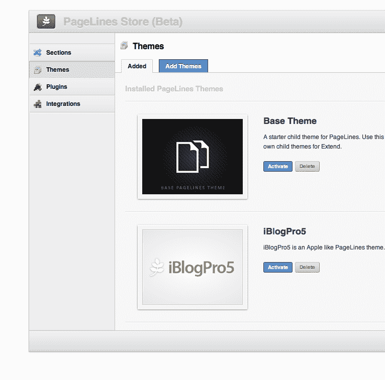

# 为 WordPress 拖放部分、插件和主题推出“应用商店”

> 原文：<https://web.archive.org/web/http://techcrunch.com/2011/11/04/pagelines-to-launch-an-app-store-for-wordpress-drag-drop-sections-plugins-and-themes/>

# 为 WordPress 拖放部分、插件和主题推出一个“应用商店”

一年前，在拉斯维加斯的 BlogWorld 博览会上，PageLines 宣布发布了用于 WordPress 的拖拽设计框架[平台](https://web.archive.org/web/20230203075522/http://www.pagelines.com/themes/platformpro/)。该产品提供了一些很酷的 CMS 设计选项，一个拖放布局编辑器，以及一个完全可配置的模板生成器，用于创建定制网站。自那以后，PageLines 的平台已经被下载了 40 万次，并成为去年 WordPress.org 最受欢迎的框架之一。

回到今天的博客世界博览会， [PageLines](https://web.archive.org/web/20230203075522/http://www.pagelines.com/) 今天宣布将于 12 月 8 日推出其框架的 2.0 版本，其中将包括一个漂亮的新市场:PageLines 商店。对于开发人员、设计人员或那些想创建酷网站而不用担心编码的人来说，这应该是感兴趣的。该商店基本上是一个“拖放”部分、插件、部分和主题的应用程序商店——所有这些都是由开发人员为 PageLines 社区构建的。商店中的应用程序将从定制网站风格的拖放部分到电子商务或社区论坛及其他功能的集成系统。

对于开发者来说，PageLines 商店提供了接触几十万用户的机会，同时从每笔销售中抽取 70%的分成。开发商可以设定价格。

该初创公司还宣布了 PageLines 开发者社区、研讨会和 LeContest，根据该初创公司的博客帖子，这些都将“专注于教育和帮助设计师和开发者通过 PageLines 取得成功”。就竞赛而言，所有开发者所要做的就是构建一个很酷的插件，拖放功能等。，PageLines 将从中挑选出一些最佳作品，于今年 12 月在巴黎的 LeWeb’11 上发布。更多信息，[点击这里查看比赛](https://web.archive.org/web/20230203075522/http://www.pagelines.com/launch/lecontest/)。

至于 PageLines v2.0，新框架将包括一个改进的布局编辑器，一个直观的用户界面，响应性设计，动态颜色处理和改进的性能，PageLines 首席执行官 Andrew Powers 说。新框架将通过 PageLines 的网站销售，普通许可证的费用为 197 美元。开发者版本将包括 Mediawiki 和 Vanilla forum 软件的集成，售价 397 美元。

