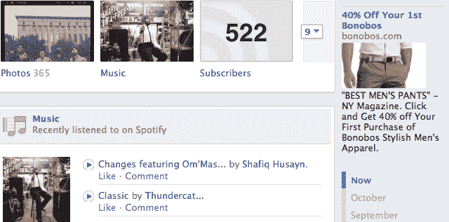
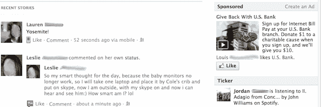

# 脸书测试将广告推向顶端的主页重新设计|技术危机

> 原文：<https://web.archive.org/web/http://techcrunch.com/2011/11/05/facebook-home-page-ads/?utm_source=feedburner&utm_medium=feed&utm_campaign=Feed:+Techcrunch+(TechCrunch>)

# 脸书测试将广告推向顶端的主页重新设计

如果您今天查看脸书的 Ticker feed 实时更新，您可能会发现自己正盯着广告。一些脸书用户现在看到了主页的重新设计版本，在右边栏的顶部放置了广告单元。滚动条、事件和生日被移到了这些广告的下方。同样，现在有些人会在右侧边栏中看到重新定位在时间线个人资料导航栏上方的广告。测试中，窗口足够宽以至于 Ticker 可以被捕捉到最右边的人在侧栏中看到的广告比其他任何东西都多。

通过让广告在网站最常浏览的部分更突出，用户可能更有可能点击或至少看到它们。如果脸书将这一重新设计推广到整个用户群，可能会显著增加该网站高端主页和个人资料广告库存的价值。或者，通过动态地重新排列主页和个人资料侧栏，脸书可以不断地欺骗用户在他们希望看到滚动条或导航栏的地方看广告。无论哪种方式，这些变化都可能让它向广告商收取更多的费用，并增加收入。

脸书很少把底线放在用户体验的利益之上，但在这里它确实做到了。[滚动条的关键是允许用户使用实时更新](https://web.archive.org/web/20230307040758/https://techcrunch.com/2011/09/20/facebook-news-feed-gets-smarter%E2%80%94%C2%A0and-the-ticker-makes-its-big-debut/)，而不必切换到新闻提要的单独“最近”标签。通过将 Ticker 隐藏在广告下面，用户不太可能注意到朋友邀请某人一起吃饭，或者围绕张贴的链接展开对话。他们也不太可能注意到当天有活动或朋友生日。

在时间线上，重新设计更有意义。通过降低时间线导航栏，它更接近于当用户点击查看上个月或去年的内容时实际移动的更新源。聪明的是，如果用户确实向下滚动时间轴，使得广告变得模糊不清，那么广告会突然重新出现在导航器下方，并开始浮动，从而保持可见。

目前只有有限的一部分用户看到了这些重新设计，所以它们可能会像出现时一样迅速消失。然而，脸书甚至正在测试他们的事实表明，它可能会在愿意给广告商的房地产方面有所松动。传统上，脸书采取了一种长期的盈利方式，尽可能不引人注目地制作广告来吸引用户。尽管该公司预计将于 2012 年首次公开募股，但它可能有兴趣增加广告收入以吸引投资者，即使这会略微降低可用性。

