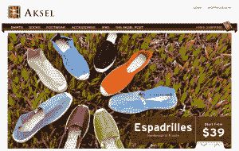

# Aksel 从 500 家初创公司筹集了 50 万美元，将欧洲男士时尚带到美国

> 原文：<https://web.archive.org/web/http://techcrunch.com/2011/11/07/aksel-raises-500k-from-500-startups-more-to-bring-european-mens-fashion-to-the-u-s/>

直接面向消费者的网上男装店[AkselParis.com](https://web.archive.org/web/20230204111845/http://akselparis.com/)背后的公司 Aksel Group 本周宣布，它已经筹集了 50 万美元的种子资金。这轮融资由[灵感创投](https://web.archive.org/web/20230204111845/http://www.inspirationventures.com/)牵头，参与方包括戴夫·麦克卢尔的 [500 家初创企业](https://web.archive.org/web/20230204111845/http://500.co/)、法布里斯·格林达、 [OLX](https://web.archive.org/web/20230204111845/http://www.olx.com/) 的创始人、IG Expansion 的若泽·马林、I/O 创投的保罗·布拉吉尔以及法国企业家尼古拉斯·伯纳迪。

那么，这家男装公司到底是什么让投资者对其前景充满期待呢？嗯，[这有点像 J. Hilburn](https://web.archive.org/web/20230204111845/https://techcrunch.com/2011/03/23/three-years-after-launch-mens-custom-clothier-j-hilburn-discovers-e-commerce/) ，因为它试图通过直接向消费者销售来省去中间商(和加价)。哦，还有欧洲风格。

总部位于旧金山的 Aksel 以实惠的价格销售奢侈品，如衬衫、袜子、鞋类(以及 iPad 保护套等配件)，所有这些都是在欧洲制造的。未来几周，Aksel 将推出外套和围巾，并将利用新一轮融资来扩大产品线，重点是分销在美国没有业务的欧洲品牌。该公司计划在今年年底前推出 20 个品牌。

Aksel 创始人兼首席执行官 Yazid Aksas 说，在网上直接向消费者销售奢侈品可以让公司以 30%到 50%的折扣提供产品。例如，通过像戴尔一样削减商店的佣金，该公司可以提供比百货商店更好的商品，但在价格上却不相上下。

又是奖金？运费(美国境内)是免费的。这位首席执行官表示，到目前为止，由于独特的忠诚度方法，该品牌已经在年轻专业人士中建立了忠诚的追随者:Aksel 以其最忠诚的客户命名其衬衫，这些客户反过来成为品牌的倡导者。

阿克塞尔希望，通过提供一个受欧洲影响的品牌，为美国市场量身定制，它可以提供具有时尚外观的服装，但也可以解决在美国变得流行的不太正式、不打领带的文化。该公司希望成为男士时尚的一站式商店，分销在欧洲获得关注但在美国却鲜为人知的品牌。

这位首席执行官说，欧洲有许多中型品牌在美国没有市场，因为它们必须经历痛苦才能接触到美国消费者。因此，通过 Aksel，他希望为这些品牌提供一种在美国分销商品的简单方式。但这位法国人说，Aksel 不会是那种由 5000 美元的外套组成的在线服装商店，重点将是不仅好看，而且休闲、实惠的服装。

更多信息，[请点击](https://web.archive.org/web/20230204111845/http://akselparis.com/)查看 Aksel 的主页。