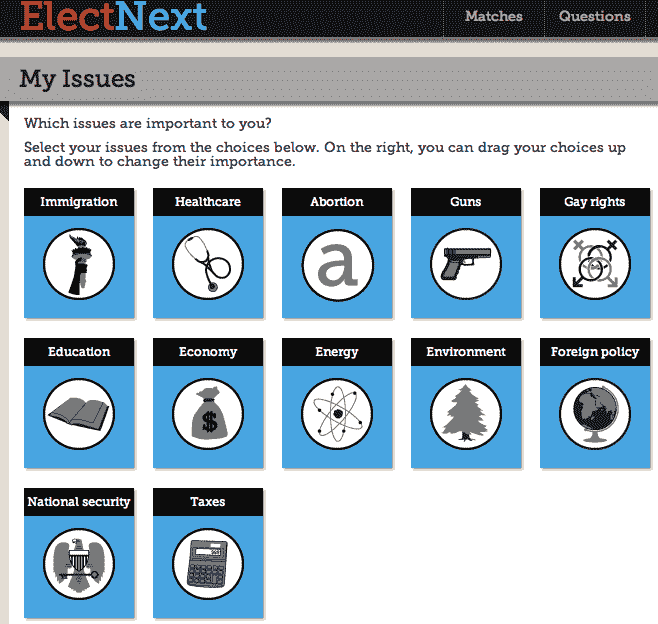
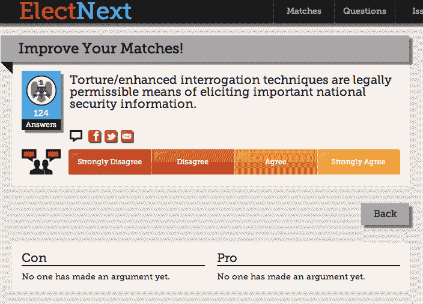

# DreamIt 支持的 ElectNext 推出了“选民电子和谐”TechCrunch

> 原文：<https://web.archive.org/web/http://techcrunch.com/2011/11/07/dreamit-backed-electnext-launches-an-eharmony-for-voters/>

[ElectNext](https://web.archive.org/web/20230205042724/http://www.electnext.com/) ，毕业于 [DreamIt Ventures 的 2011 年秋季班](https://web.archive.org/web/20230205042724/https://techcrunch.com/2011/09/08/dreamit-ventures-launches-its-fall-2011-philadelphia-class/)，今天推出测试版，将选民与最能反映他们价值观的政治候选人匹配起来。该网站喜欢将自己描述为“选民的 eHarmony”，提供了一个熟悉的概念，这要感谢[几十个](https://web.archive.org/web/20230205042724/https://www.google.com/search?aq=0&oq=which+politic&sourceid=chrome&ie=UTF-8&q=which+political+party+am+i)政治主题的测验，试图找出哪个政党最符合你的个人兴趣和信仰。

但是，ElectNext 通过将你的信念与当前选举中实际候选人的信念进行匹配，将政治测验推向了一个新的高度。

首先，你必须注册该网站，或者使用你的脸书或推特账户进行连接。

你不是以一个小测验开始，而是被送到一个页面，在那里你可以组织和排列对你来说重要的问题，如移民，医疗保健，堕胎，枪支控制，教育，同性恋权利，经济，能源，环境，外交政策，国家安全和税收。排名很简单——你只需点击问题的名称，它就会出现在页面右侧的列表中。

接下来是测验，要求您回答至少 6 个问题，以获得候选人建议。当然，回答的问题越多，效果越好。

该测验的唯一问题是，它假设您对当前的政治、事件、军事行动、条约等有持续的了解，因为包含的“了解更多”链接没有提供关于该主题的任何其他信息。这是因为“了解更多”部分依赖于众包，要求 ElectNext 用户提交每个问题的“优点”和“缺点”。

由于这项服务刚刚推出，我在测试中遇到的所有部分仍然是空白。如果创始人在发布之前至少在这些问题中植入一些细节就好了，因为——让我们面对现实吧——不知道该投谁的人可能也是那些需要帮助理解这些问题的人。

完成测验后，会显示哪些联邦候选人符合您的观点，如果您输入邮政编码，还会显示您的最佳选择参议员和众议员。有关结果的更多详细信息，您可以单击每个候选人下方的“查看原因”按钮，了解推荐该候选人的更多原因。

结果也可以通过脸书、推特和电子邮件分享。

我测试中的候选人匹配似乎相当准确，尽管我并不真的需要一个网站来告诉我我会投哪一方——我已经知道了。然而，对于“骑墙派”投票者来说，类似这样的东西可能会帮助他们做出最终选择，尤其是考虑到该网站的易用性。

ElectNext 由宾夕法尼亚大学沃顿商学院和研究生 Keya Dannenbaum 和 Paul Jungwirth 创建，他们从一个两党专家小组获得问题，其中包括来自哈佛、宾夕法尼亚大学和普林斯顿大学的常春藤盟校教授。该服务现已上线，但将于周二正式庆祝其在费城[Tedx](https://web.archive.org/web/20230205042724/http://www.tedxphilly.com/)的推出，随后将于明晚 8 点在费城老城[国家机械](https://web.archive.org/web/20230205042724/http://www.nationalmechanics.com/)举行发布会。