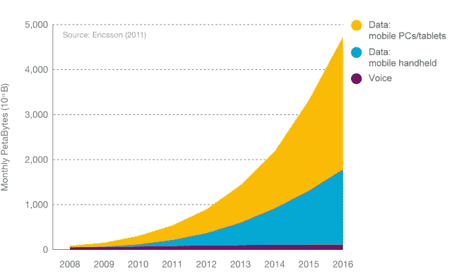
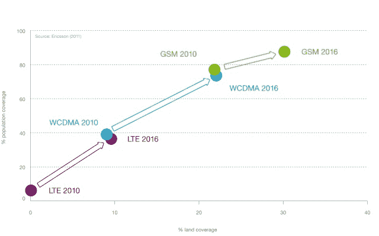
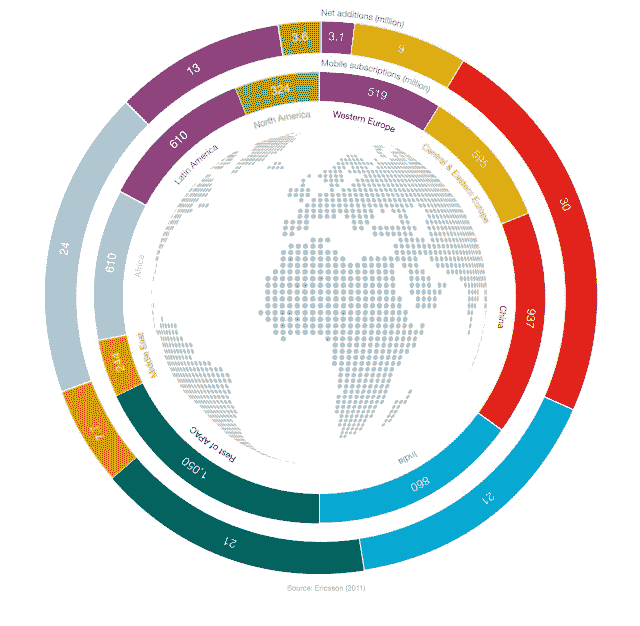

# 爱立信预测，到 2016 年，移动宽带用户将达到 50 亿，数据流量将增长 10 倍 TechCrunch

> 原文：<https://web.archive.org/web/http://techcrunch.com/2011/11/07/ericsson-forecasts-5-billion-mobile-broadband-subscribers-data-traffic-to-grow-tenfold-by-2016/>

# 爱立信预测，到 2016 年，移动宽带用户将达到 50 亿，数据流量将增长 10 倍

为全球电信运营商提供技术和服务的爱立信预测，未来五年内，移动数据流量[将增长十倍](https://web.archive.org/web/20230203104506/http://www.marketwire.com/press-release/ericsson-predicts-mobile-data-traffic-to-grow-10-fold-by-2016-stkm-eric-1582638.htm)，主要由视频驱动。

爱立信在其最新的[流量和市场数据报告](https://web.archive.org/web/20230203104506/http://hugin.info/1061/R/1561267/483146.pdf)中预测，到 2016 年，移动宽带用户将超过 50 亿。该公司早些时候预测这个数字在 2011 年将超过 10 亿，但是现在预测到年底将达到 9 亿。

根据该报告，今年移动数据流量将翻一番，主要是由于智能手机、平板电脑和其他设备的销售激增。2011 年，智能手机的总流量预计将增长两倍。该公司表示，预计到 2016 年，居住在地球不到 1%土地上的用户将产生大约 60%的移动流量。

这份报告是基于爱立信几年来在 180 多个国家对手机语音和数据量的测量。

另见:[连接的过去、现在和未来:必看的迷你电影](https://web.archive.org/web/20230203104506/https://techcrunch.com/2011/11/04/the-past-present-and-future-of-connectivity-a-must-see-mini-film/)

