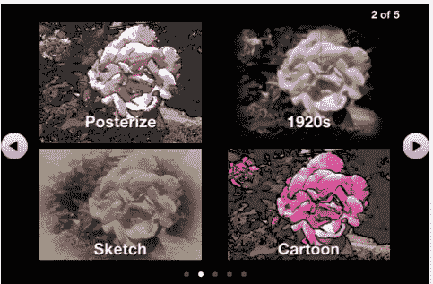

# 脸书 Acq-雇用移动视频和图像编辑应用程序开发人员数字楼梯 TechCrunch

> 原文：<https://web.archive.org/web/https://techcrunch.com/2011/11/07/facebook-acquires-mobile-video-and-image-editing-app-developer-digital-staircase/>

# 脸书 Acq-雇用移动视频和图像编辑应用程序开发人员数字楼梯

根据一篇在创业公司网站上的[博客文章](https://web.archive.org/web/20230205003823/http://blog.digitalstaircase.com/)，看起来脸书刚刚从 acq 雇佣了移动视频和图像应用程序开发者[数字楼梯](https://web.archive.org/web/20230205003823/http://www.digitalstaircase.com/)。据脸书称，数字楼梯的团队将加入社交网络，但脸书没有从这家初创公司获得任何技术资产。

数字楼梯开发了许多用于视频录制、图像编辑等的应用程序。MovieCam 作为 iPad 和 iOS 应用程序提供，是一款摄像机应用程序，提供 8 倍数码变焦、暂停和恢复录制功能以及对比度增强等录制功能。该应用程序还允许您在拍摄视频时添加 18 种电影效果和滤镜。

iPhone 应用程序 StereoCam 有助于快速创建立体图像对。立体图像对由两个特别设计的图像组成，这两个图像并排放置，以允许观看者(采用适当的观看技术)完整地看到所描绘的场景。

另一个 iOS 应用 SmartSplice 使用高级图形算法来提高创建高质量图像选择的速度和易用性，并提供图像过滤器和创建专业外观图像效果的方法。

从帖子来看，开发团队可能正在给脸书本身增加一些功能。不幸的是，Digital Staircase 将从苹果应用商店移除其应用。

*亲爱的数字楼梯客户、关注者和支持者们，
很难相信我们创办数字楼梯已经三年了。正如任何初创公司一样，也有起有落，但我们一直与大家一起努力，创造新的图形应用和工具，让视觉计算的乐趣触手可及。我们今天宣布，我们将被脸书收购，以帮助将这些移动创新带给更广泛的受众。许多事情可能会改变，但我们对沉浸式体验的专注不会改变。
几周内(大约 2011 年 12 月 5 日)，我们将关闭作为独立实体的 Digital starling，并将从苹果 iTunes 商店中移除所有 iOS 产品。拥有应用程序(MovieCam、SmartSplice、StereoCam 等)的用户仍可以在当前设备上使用它们。请留意新的创新将被添加到脸书。
感谢所有的支持，如果您有更多的建议、意见和反馈，请随时联系我们 support@digitalstaircase.com 公司。我们一直在寻找改善用户体验的方法。
谢谢，
数字楼梯团队*

