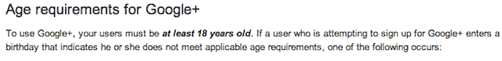

# Google+页面年龄选择器标志着 18 岁以上年龄限制的结束

> 原文：<https://web.archive.org/web/http://techcrunch.com/2011/11/07/google-age-limit/>

# Google+页面年龄选择器标志着 18 岁以上年龄限制的结束

根据新 Google+页面中的年龄选择器选项来判断，管理员可以将功能限制在 18 岁以上，18 岁以下的用户最终将能够加入社交网络。目前，Google+仅限于 18 岁及以上的人，不包括 13-17 岁可以注册 Gmail 账户的人。虽然人们认为 Google+在完成“实地测试”后会将其年龄限制降低到符合 COPPA 标准的 13 岁及以上，但年龄选择器选项几乎保证了这一点。

使用今天早上发布的 [Google+ Pages 产品上的年龄选择器，管理员可以设置它，这样根据](https://web.archive.org/web/20230205045013/https://techcrunch.com/2011/11/07/google-launches-pages-opens-floodgates-for-brands-and-everything-else/) [Google+支持](https://web.archive.org/web/20230205045013/http://www.google.com/support/plus/bin/answer.py?hl=en&p=pages_age_restrictions&answer=1710992)的说法，“需要用户登录的互动功能将限于最小年龄或更大的用户”。年龄选项包括“任何 Google+用户”和“18 岁及以上用户”。只有当 18 岁以下的用户有一天可以使用这项服务时，第二种选择才是必要的。

当 Google+首次推出并再次向公众开放时，一些人感到惊讶的是，它排除了以分享大量内容而闻名的人群。这种分享以及年轻群体邀请整个网络使用新服务的意愿可能有助于 Google+的发展。谷歌可能已经评估过，把未成年人从其他用户群中隔离出来并不是优先考虑的事情。

这可能不是最明智的举动，因为我认为 Google+已经浪费了最初的增长势头，以至于它永远不会像脸书那样迅猛发展。这种增长可能对谷歌的计划或服务的长期成功并不重要。它还可能有助于为 Google+上托管的内容类型和关系建立更成熟的规范。尽管如此，原始用户数量对于吸引开发者、品牌和更多用户来说还是很重要的。

现在看来，当 Google+准备就绪时，它将接纳 13-17 岁的青少年，而与烟草等不适合未成年人的话题相关的页面将能够排除已登录的青少年。此外，Google+ Pages 针对特定年龄群体(如未成年人)发布帖子的潜在能力可能是 T4 超越脸书 Pages 产品 T5 的一种方式。

