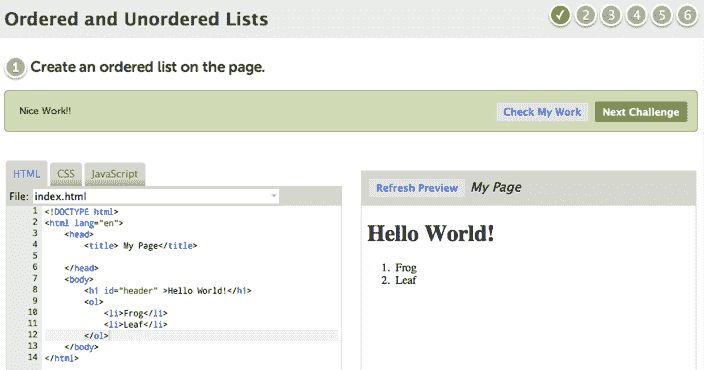
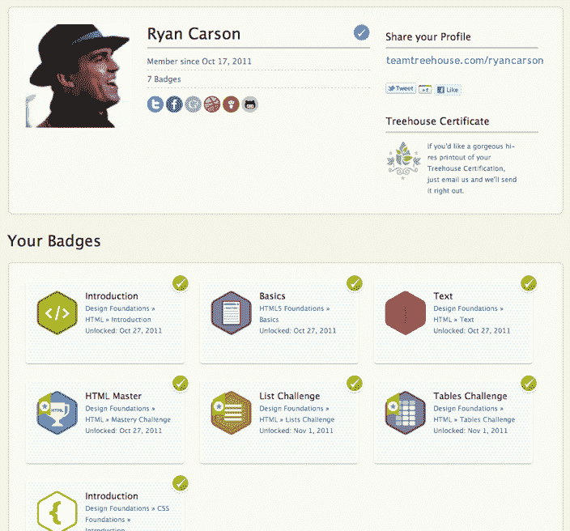
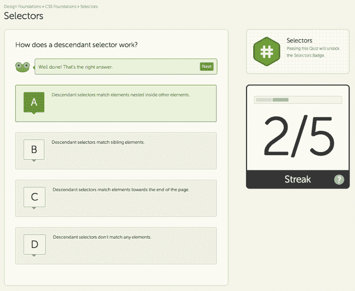
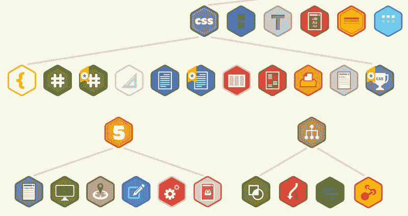

# 网页设计和开发社区 Treehouse 想教你如何编码，给你一份工作 TechCrunch

> 原文：<https://web.archive.org/web/http://techcrunch.com/2011/11/07/web-design-and-development-community-treehouse-wants-to-teach-you-how-to-code-get-you-a-job/?utm_source=dlvr.it&utm_medium=twitter>

# 网页设计和开发社区树屋想教你如何编码，给你一份工作

刚刚获得 60 万美元种子资金的开发者教育初创公司 [Treehouse](https://web.archive.org/web/20230203163738/http://teamtreehouse.com/) 今天早上向公众推出，使用视频、测验和徽章在几个月内将表面上的任何人从 00b 带到 1337。

与 [Codeacademy](https://web.archive.org/web/20230203163738/http://www.codecademy.com/) 和 [Lynda](https://web.archive.org/web/20230203163738/http://www.lynda.com/) 不同，Treehouse 提供了广泛的专家指导的网页设计、开发和 iOS 开发主题( [HTML](https://web.archive.org/web/20230203163738/http://teamtreehouse.com/library/design-foundations/html) 、 [CSS 基础](https://web.archive.org/web/20230203163738/http://teamtreehouse.com/library/design-foundations/css-foundations)、[技术基础](https://web.archive.org/web/20230203163738/http://teamtreehouse.com/library/design-foundations/technology-foundations)、[美学基础](https://web.archive.org/web/20230203163738/http://teamtreehouse.com/library/design-foundations/aesthetic-foundations)、编程入门等)，并且已经实现盈利，因为它每月向用户收取 29 至 49 美元的程序使用费。

Treehouse 与该领域其他公司的不同之处还在于，用户如果在测验中连续答对五个问题，或者完成浏览器内的代码挑战，就会赢得徽章(见下文)，目的是在[http://teamtreehouse.com/yourprofile](https://web.archive.org/web/20230203163738/http://teamtreehouse.com/yourprofile)建立他们的公共档案。

[vimeo 31702880 w=640]

雅诗兰黛、迪士尼和维珍等几家蓝筹公司已经签约使用这项服务进行员工培训，LivingSocial、WordPress/automatic 和 BankSimple 等初创公司也在招募合格的树屋成员，他们需要获得必要的徽章。

“我们计划让数百万未就业或‘就业不足’的人摆脱低薪和不满意的工作，进入高薪和令人兴奋的设计和开发工作，”联合创始人瑞安·卡森说。他希望这项服务将减少全球开放网络和 iOS 应用程序的职位空缺，并对世界经济产生积极影响。

卡森告诉我，“一个计算机科学学位可能要花费你 5 万美元，而且要花四年时间才能完成，”树屋可以给你所需的技能，最后还能给你一份潜在的工作，六个月内只需 150 美元。”

为了进一步提高其成员的就业能力，卡森计划尽快在树屋课程中增加更多课程，例如 iOS 5 基础、Ruby 基础和 PHP 基础。“基本上，网页开发者、设计者和 iOS 设计者/开发者需要知道的任何话题，我们都会解决，”他说。

Treehouse 值得注意的支持者名单包括投资者[雷德·霍夫曼](https://web.archive.org/web/20230203163738/http://www.crunchbase.com/person/reid-hoffman)、[凯文·罗斯、](https://web.archive.org/web/20230203163738/http://www.crunchbase.com/person/kevin-rose) [大卫·司达、](https://web.archive.org/web/20230203163738/http://www.crunchbase.com/person/david-sze) [查马斯·帕里哈皮蒂亚](https://web.archive.org/web/20230203163738/http://www.crunchbase.com/person/chamath-palihapitiya)、[马克·苏斯特](https://web.archive.org/web/20230203163738/http://www.crunchbase.com/person/mark-suster)和顾问，如 Automattic 的[马特·莫楞威格](https://web.archive.org/web/20230203163738/http://www.crunchbase.com/person/matt-mullenweg)、Twitter 的[道格·鲍曼](https://web.archive.org/web/20230203163738/http://twitter.com/#!/stop)和 BankSimple 的[亚历克斯·佩恩](https://web.archive.org/web/20230203163738/http://www.crunchbase.com/person/alex-payne)。

