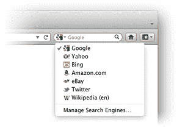

# Firefox 8 现已正式推出，包括内置 Twitter 搜索 TechCrunch

> 原文：<https://web.archive.org/web/https://techcrunch.com/2011/11/08/firefox-8-now-officially-available-includes-built-in-twitter-search/>

适用于 Windows、Mac 和 Linux 的新版 Firefox 网络浏览器 [Firefox 8](https://web.archive.org/web/20230203165135/http://www.mozilla.org/en-US/firefox/new/) 已经正式上线。实际上，[已经在几天前](https://web.archive.org/web/20230203165135/http://www.techmeme.com/111106/p9#a111106p9)通过 Mozilla 的 FTP 服务器发布了更新，引入了几个新功能，包括内置的 Twitter 搜索选项，更好的插件和标签管理，以及常见的性能和稳定性修复。

Mozilla 还更新了 Android 版 Firefox，提供密码管理和将书签保存到设备主屏幕的支持。

 新增加的 Twitter 搜索功能可能是更新后的浏览器最直接有用的功能，因为它可以让你直接从火狐的搜索/地址栏中搜索主题、@用户名和#标签。在推出时，Twitter 搜索有英语、葡萄牙语、斯洛文尼亚语和日语版本的 Firefox，并计划在未来的版本中推出其他语言版本。

其他新设置包括按需加载选项卡的能力(通过菜单–>选项/首选项，常规选项卡)，使恢复具有许多选项卡的窗口更快的功能，以及改进的附加管理。以前第三方开发者可以不经过你的允许就在你的浏览器里安装插件，现在是(谢天谢地！)，不再如此。Firefox 8 会默认禁用第三方安装的插件，你必须选择你想保留的。

在引擎盖下，Firefox 增加了对跨来源资源共享( [CORS](https://web.archive.org/web/20230203165135/http://hacks.mozilla.org/2011/11/using-cors-to-load-webgl-textures-from-cross-domain-images/) )的支持，这允许开发者更安全地加载 [WebGL](https://web.archive.org/web/20230203165135/http://en.wikipedia.org/wiki/WebGL) 纹理。(WebGL 是一种网络标准，允许网站在没有第三方软件的情况下显示硬件加速的 3D 图形)。浏览器也继续支持 HTML5 标记，Mozilla 列出了一些将会影响网络开发者的变化[。](https://web.archive.org/web/20230203165135/https://developer.mozilla.org/en/Firefox_8_for_developers)

在 Android 平台上，Mozilla 推出了一个新的“主密码”功能，允许用户在应用程序中私下保存他们所有的用户名和密码，并表示即使你的手机丢失或被盗，这些也将保持隐私。第二个 Android 独有的功能是现在可以将书签保存到移动设备的主屏幕上，以便快速访问。

总的来说，Firefox 8 不是浏览器的重大更新，也没有引入任何看起来足够吸引人的功能来说服快乐的 Chrome 用户重新使用。然而，鉴于 Mozilla 早些时候承诺以更小、更频繁的捆绑形式向用户提供其技术，此次发布是值得注意的。在其路线图中，Mozilla 表示计划在今年发布 Firefox 4、5、6 和 7。现在是 10 月，Mozilla 已经发布了 Firefox 8.0。进展很快啊，伙计们。