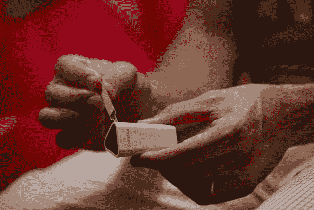

# Scanadu 提出$2M:“像检查电子邮件一样经常检查你的身体”

> 原文：<https://web.archive.org/web/https://techcrunch.com/2011/11/08/scanadu-raises-2m-check-your-body-as-often-as-your-email/?icid=tc_home_art>

# 斯堪纳杜提出$2M:“像检查电子邮件一样经常检查身体”

见见创新的健康科技初创公司 Scanadu，我敢说你将来会听到更多。解释该公司在这一点上正在建造什么并不是最容易的任务，但让我们称之为个人、移动、自动诊断产品——他们称之为医疗三录仪。

Scanadu 成立于 2011 年 1 月，由一群背景各异的企业家组成，其历史可以追溯到很久以前。该公司的创始人之一兼首席执行官是[Walter De Brouwer](https://web.archive.org/web/20230203132827/http://en.wikipedia.org/wiki/Walter_de_Brouwer)——在比利时企业家圈子内外，他都是一个传奇人物。

他说，早在 1999 年，当他在著名的 [Starlab](https://web.archive.org/web/20230203132827/http://en.wikipedia.org/wiki/Starlab) 研究所工作时，他就有了个人健康监测服务的基本想法，这是他与麻省理工学院媒体实验室创始人[尼古拉斯·尼葛洛庞帝](https://web.archive.org/web/20230203132827/http://www.crunchbase.com/person/nicholas-negroponte)一起启动的。看《星际迷航》的时候。

“科幻故事是伪装的商业计划，”德·布劳威尔告诉我，他指的是受《星际迷航》通讯器启发而发明的手机。“1999 年，我曾试图在 Starlab 制造三录仪，但当时的技术太不成熟。”

De Brouwer 说，2006 年，当他的儿子在一次严重事故后住院 3 个月时，这个想法重新浮现在他的脑海中。因此，他想到了将智能手机用作某种私人医生的想法，利用现代手机可以做的许多事情来帮助人们自动诊断和管理可能出现的许多容易识别的健康状况。

Scanadu 的第一款产品“医疗三录仪”是专为有孩子的父母打造的，有助于避免因信息不足和/或焦虑而去医院的昂贵旅程。

“今天，你家里的健康工具可能包括体温计和一盒创可贴。我们可以做得更好，”联合创始人兼首席运营官·米沙·切拉姆说。

该公司与 IDEO 合作制作了一个视频，很好地捕捉了其核心愿景，其中包括我在这篇文章的标题中引用的话，尽管是转述。可以在下面看。

Scanadu 已经从全球天使投资者网络中筹集了 200 万美元，其中包括 Playfish 的联合创始人 Sebastien De Halleux，目前正在将团队从比利时转移到旧金山湾区(实验室正在美国宇航局的研究园区建立)。

该公司正在建立一个由生物医学工程师、软件和硬件开发人员以及人工智能专家组成的核心团队。他们还有一个医疗顾问委员会，其中包括斯坦福大学附属的丹尼尔·克拉夫特博士和 T2 的乔丹·史林博士，他是 Healthloop 和 Current Health 的创始人。

Scanadu 目前正在寻求与远程医疗和诊断技术初创公司建立技术合作伙伴关系，并雇佣更多人加入其建立个人“口袋医生”的探索。

[YouTube http://www.youtube.com/watch?v=KSwMauCno6o&w=640&h=400]