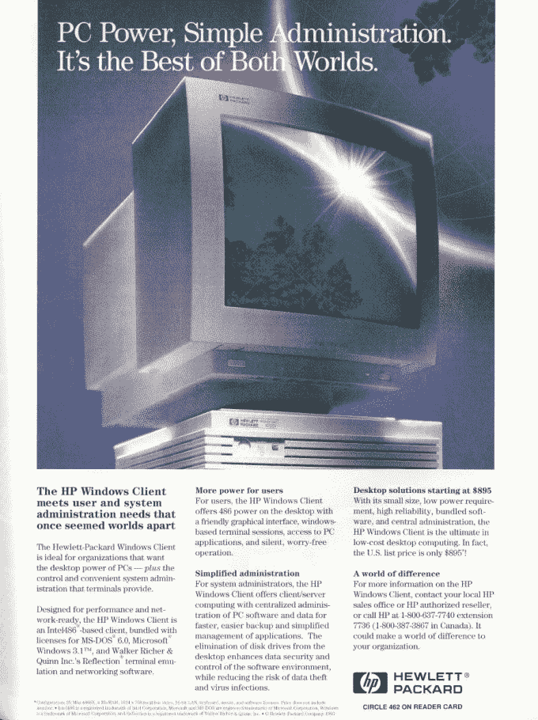

# 带着这些老式电脑广告漫步在记忆中

> 原文：<https://web.archive.org/web/http://techcrunch.com/2011/11/08/stroll-down-memory-lane-with-these-vintage-pc-ads/>

# 带着这些老式电脑广告漫步在记忆中

我通常不会链接到集中于一个主题的大量图片，除非我给我的 LARP 家族发送潜在的霜冻少女服装的例子。然而，这太好了，不能错过:[这是一组 30 个老式电脑广告](https://web.archive.org/web/20230203155635/http://www.andysowards.com/blog/2011/30-retro-print-computer-ads-from-the-90s-vintage-geek-design-nostalgia/)，展示了我童年的一些标志性图像，相当于褪色的旧《花花公子》页面(这是对诺曼·梅勒的采访)，你撕下来藏在一本霍伊尔的《游戏规则》中，多年后当你在家清理旧衣柜时突然被重新发现(真实故事)。简而言之，它产生了极客们喜欢的颤栗和怀旧的混合体。

这些图片包括来自苹果的 Think Different 广告，以及一些对比尔·克林顿的高格调评论和一些令人惊叹的 VGA 图形。我一直喜欢 20 世纪 80 年代中期的个人电脑设计，尤其是下面的青蛙式惠普，它有着大胆的水平线和未来派的喷枪，据说是“高科技”的信号，但实际上是“未充分就业的哑光画家被从*太空猎人:禁区冒险的布景中解雇了”。*

你可以在这里查看所有的广告。

[幻灯片]