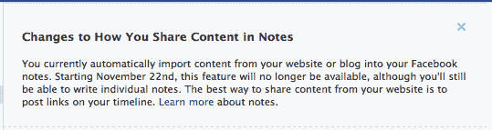

# 脸书在众所周知的 RSS 棺材上加了一颗钉子，扼杀了 Notes TechCrunch 中的“进口”

> 原文：<https://web.archive.org/web/https://techcrunch.com/2011/11/09/facebook-adds-another-nail-to-the-proverbial-rss-coffin-kills-off-import-in-notes/>

# 脸书在众所周知的 RSS 棺材上加了一颗钉子，扼杀了 Notes 中的“进口”

坏消息是，实际上使用过这个功能的十个人，脸书已经[改变了它的笔记设置](https://web.archive.org/web/20230203080642/https://www.facebook.com/help/?faq=277347965620183)，并且最终将取消通过 RSS 导入个人脸书页面的博客条目。因为在“[土拨鼠日、](https://web.archive.org/web/20230203080642/http://www.imdb.com/title/tt0107048/)”中，RSS 已经[死而复生](https://web.archive.org/web/20230203080642/http://techmeme.com/search/query?q=rss+dead&wm=false)的次数比比利·穆雷还多，所以我打算让赞成和反对的意见在评论中展开讨论。

当然，你是赞成还是反对取决于你特定的互联网使用习惯。我想说的是，我从来没有以任何有效的方式积极地使用过 RSS(比如在谷歌阅读器中)，当我问一些随机的人对此有何看法时，我得到的回答是，“没什么大不了的，RSS 有点死了。”

“RSS 并没有消亡，”你争辩道，“当这篇文章被自动发送到 TWITTER 时，你也在使用它。”好吧，好吧，你赢了。事实上，脸书[仍然允许人们通过 RSS 订阅](https://web.archive.org/web/20230203080642/http://www.insidefacebook.com/2011/05/24/subscribe-via-rss-pages/)页面更新，这意味着即使这样也不对。

但是 MG 是对的，他写道，“事实仍然是 RSS 不是一种消费者友好的技术。如果我对我妈妈说“RSS ”,她绝对不知道我在说什么。如果我对她说“推特”或“脸书”,她知道这些是谁——她甚至会使用它们。也就是说，RSS 仍然经常为她所知道的那些服务提供至少部分的主干网。

MG 认为，随着时间的推移，对 RSS 的依赖将开始减少，因为人们~~被迫~~习惯于通过按钮分享内容(就像我们在脸书这里看到的那样)。“让人们与你的内容互动的最佳方式是通过添加个人评论和回应粉丝的反馈，让他们了解你在你的墙上分享的链接，”脸书帮助页面欢快地说道。

为了记录在案，我问我的继母是否知道什么是 RSS，她说“有点”。

哦还有 [lols。](https://web.archive.org/web/20230203080642/http://www.flickr.com/photos/skysoclear/5555519666/lightbox/)