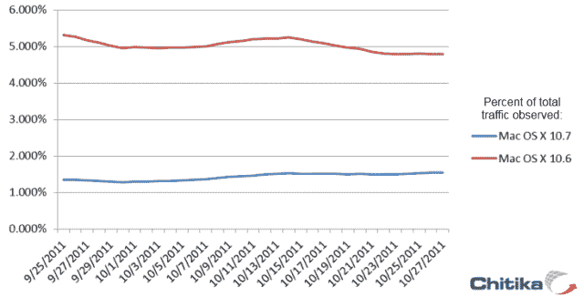

# Lion Install Numbers 没什么可炫耀的 TechCrunch

> 原文：<https://web.archive.org/web/http://techcrunch.com/2011/11/09/lion-install-numbers-nothing-to-roar-about/>

首先，让我为标题道歉。现在，新闻。看起来 Mac OS X[Lion](https://web.archive.org/web/20230203101527/https://techcrunch.com/tag/lion/)并没有在 Mac 世界掀起风暴:在 7 月 20 日发布 10.7 之后，[的初期销售活跃](https://web.archive.org/web/20230203101527/https://techcrunch.com/2011/10/04/six-million-copies-of-os-x-lion-sold-outpaces-snow-leopard/)之后，增长似乎已经停滞。

这是基于分析公司 [Chitika](https://web.archive.org/web/20230203101527/http://chitika.com/) 的访客跟踪，其最新数据表明，Lion 距离赶上雪豹甚至普通的老豹还有很长的路要走，尽管已经几年了，但仍占其 Mac 访客的五分之一。狮子？停滞在 16%，仅比 9 月底增长了 2%。这是一个反向曲棍球棒。

此图表显示了操作系统在其统计数据中的绝对表示。如果你可以缩小，从透视的角度来看，Windows XP 和 7 可能是这部分高度的五到六倍。

如果我们相信这些数字，那么采用率低的原因是什么呢？

我的观点很简单，T7 的功能对普通用户没有吸引力。虽然一些新的想法和功能肯定是有用的，但我承认我自己对大多数与日常使用无关感到困惑。很少有用户会看到 Mission Control 和 Launchpad，并认为“是的，这些比 Expose 和 Dock 中应用程序文件夹的快捷方式好得多。”因为事实上，他们并不比 T10 好多少。

邮件、Airdrop 和全屏应用程序对许多使用网络应用程序收发邮件、分享和处理日常事务的用户来说毫无用处。简历和磁盘加密是看不见的，对于不了解它们的临时用户来说也不是很有趣(“什么，为什么我做完了就不退出呢？”)而不会看到他们的行动。

剩下的更新显然不值得 30 美元。

这并不是说 Lion 不好，但我想我理解人们对那些不流行的功能的更新过程(备份等等，比以往任何时候都容易，但仍然超出了许多用户)的恐惧。雪豹速度快且稳定，可以访问大多数关键应用和服务。急什么？

很自然，这个数字会继续增长，因为 Lion 搭载在苹果所有受欢迎的电脑上，销量比以往任何时候都好。传闻中的 Air 风格 MacBook Pro 系列也将提供一个不错的推动。但这些趋势表明，狮航通往 OS X 霸主地位的道路将是漫长而缓慢的。