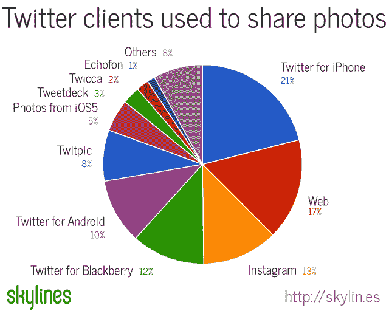

# Twitter 超越 TwitPic 和 YFrog 成为头号图片服务 TechCrunch

> 原文：<https://web.archive.org/web/http://techcrunch.com/2011/11/09/twitter-photo-service/>

# Twitter 超越 TwitPic 和 YFrog，成为排名第一的图片服务

8 月 9 日对于像 TwitPic 和 YFrog 这样的第三方 Twitter 照片分享服务来说是黑暗的一天。Twitter [推出了自己的官方服务](https://web.archive.org/web/20230203152725/https://techcrunch.com/2011/08/09/twitter-photo-uploading-now-available-for-100-of-users/)，Photobucket 是其托管合作伙伴。现在，照片搜索引擎 [Skylines](https://web.archive.org/web/20230203152725/http://skylin.es/) 与我们分享的数据显示，Twitter 已经成为平台上排名第一的照片分享服务，占有 36%的份额。TwitPic 现在处理 30%的推特照片，YFrog 下降到 21%。就在 5 个月前，TwitPic 拥有 45.7%的份额，YFrog 拥有 29.3%的份额，但现在看来，他们必须做出区分，否则就会慢慢死去。

今年 3 月，Twitter 宣布不再允许[直截了当的客户](https://web.archive.org/web/20230203152725/https://techcrunch.com/2011/03/11/twitter-ecosystem-guidelines/)，以努力促进平台的多样性，这让第三方开始感到恐慌。事实上，早在 2010 年 4 月，Twitter 的联合创始人[就预示了它可能会转移到照片领域](https://web.archive.org/web/20230203152725/https://techcrunch.com/2010/04/14/qa-twitter-execs-answer-the-tough-questions-at-chirp/)。尽管如此，当时的生态系统领导者 [TwitPic 表示，Twitter 的举动让它措手不及](https://web.archive.org/web/20230203152725/https://techcrunch.com/2011/06/01/twitter-twitpic/)，因为尽管向 YFrog 和 Plixi 发出了警告，但平台领导者从未向该公司通报过情况。

当 Twitter 宣布将为其照片分享服务开放一个 API 时，这是另一个致命的打击，允许应用程序开发者使用它而不是通过第三方照片服务来建立和保存他们的照片。当情况变得更糟时，官方照片服务的推出伴随着 Twitter 画廊的推出，Twitter 画廊允许用户查看所有推文照片，包括来自第三方的照片。

随着直接通过 Twitter 分享和查看照片变得更加容易，TwitPic 和 YFrog 的衰落似乎是必然的。Twitter 目前的总体领先优势来自其 iPhone 版 Twitter 客户端，该客户端分享到其照片服务的照片占 42%，Twitter 上分享的所有照片占 21%。它的 iOS5 集成也很成功，iOS 照片和相机合并成为第七大 Twitter 照片客户端，发布了 5%的推文照片。Instagram 上传了 12%分享到 Twitter 的照片。

然而，用户似乎在他们的行为中根深蒂固，因为 Skyline 对 10 月下旬一周内分享的 2400 万张照片的分析显示，用户并没有在一夜之间放弃第三方服务。TwitPic 仍然是 Android 设备最受欢迎的分享服务，通过谷歌移动操作系统分享的照片占 39%。与此同时，YFrog 以 47%的份额领先于黑莓设备。

尽管如此，如果他们不想让剩余的用户群流失，TwitPic、YFrog 和其他人需要提供一些独特的东西——在分享照片时润色或增强照片的方法，以及对图库进行分类的创新方法。

