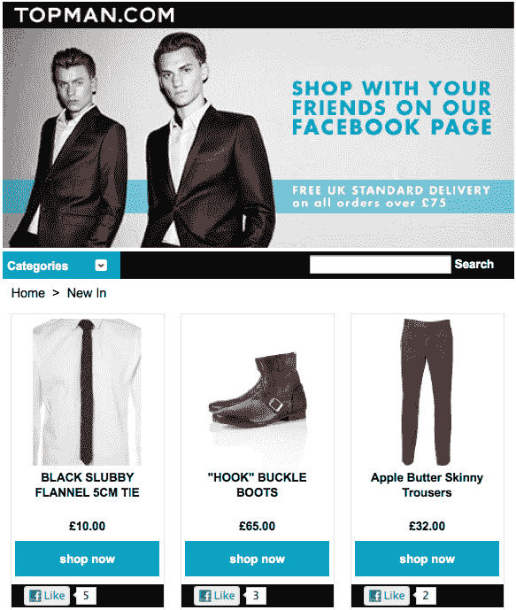

# 电子商务和脸书广告通过 Zibaba TechCrunch 融合

> 原文：<https://web.archive.org/web/http://techcrunch.com/2011/11/09/zibaba-ecommerce-ads/>

# 电子商务和脸书广告通过 Zibaba 融合

随着越来越多的品牌转向脸书托管他们的在线业务和广告，他们将寻求处理自有和付费营销管理的平台。今天，脸书电子商务店面平台 Zibaba T1 推出了一个 Ads API 功能，提供了这样一个解决方案。它允许商家根据他们最受欢迎的产品自动生成和购买广告，这样他们就可以有效地推广他们的店面。

Zibaba 是第一个将广告购买功能引入脸书电子商务平台的公司。然而，这里重要的一点是，开发者开始利用脸书最近开放其 Ads API 的优势。也就是说，他们正在将广告购买系统整合到各种垂直市场的服务中。

预计这一趋势将继续下去，更多的品牌、品牌和小企业管理平台开发商将向客户收取一定比例的费用或每次收购成本的溢价，以通过他们做广告。例如， [ReverbNation](https://web.archive.org/web/20230203075407/http://www.insidefacebook.com/2011/08/29/reverbnation-promote-it-self-serve-ads-api/) 在 8 月份用 Ads API 工具扩充了其音乐人营销平台。由于不可能通过脸书的自助工具正确地 A/B 测试或管理投标，企业可以通过基于 Ads API 的工具显著提高其活动的绩效。

虽然大多数品牌都建立了脸书网页，但他们现在的目标是获得更多的粉丝，并从这些粉丝身上赚钱。Zibaba 的 Ads API 集成电子商务平台让品牌在有产品可直接销售的情况下做到这两点。

品牌可以使用 Zibaba 在他们的脸书页面上建立一个作为标签应用程序托管的店面，并导入他们的产品目录。然后，他们可以将最畅销产品的图片和标题转化为广告，将脸书用户吸引到他们的商店。最后，他们可以监控分析，以确定哪些广告活动推动了最大的销售。

这是将 Ads API 集成到电子商务和内容管理平台的真正优势。在同一系统下运行时，更容易跟踪下游转换。随着品牌寻求衡量他们在社交网站上的投资回报，开发者将加入 Zibaba，帮助他们的客户优化转化，而不仅仅是点击。

